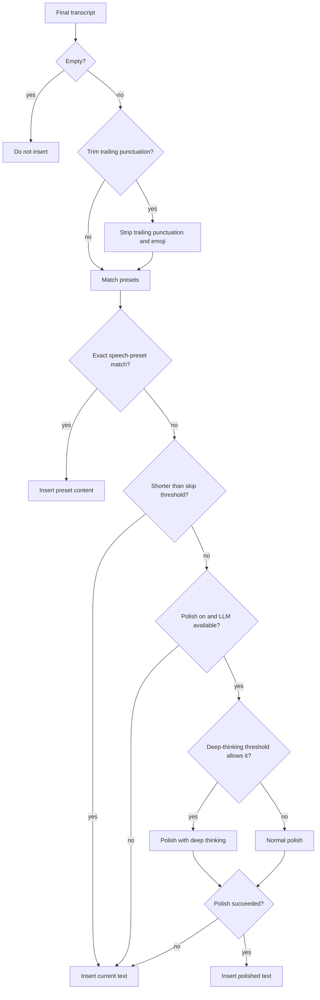

# AI Post-processing

AI post-processing uses a Large Language Model (LLM) to refine ASR transcripts. Typical improvements include removing filler words, fixing typos, adjusting punctuation, and polishing tone, making voice typing smoother and more natural.

::: info Naming note
Since v4.4.2, the settings entry is `Settings → Intelligence → AI Feature Settings`, and the UI refers to this feature as "AI polish". Both names mean the same feature.
:::

## Quick Setup

### Use free service (recommended)

BiBi Keyboard ships with **SiliconFlow free service**. No API key is required:

1. Open `Settings → Intelligence → AI Feature Settings`
2. Enable "AI post-processing"
3. Ensure vendor is **SF_FREE** (default)
4. Pick a prompt preset (recommended: "General post-process")
5. Tap the magic wand button on the keyboard to enable AI post-processing mode
6. Done — transcripts will be refined automatically

::: tip About the free service

- Has a free quota (see SiliconFlow website for details)
- Example models: Qwen/Qwen3-8B, THUDM/GLM-4-9B, etc.
- If you need other models, register on SiliconFlow and use your own API key
  :::

### Configure a paid vendor

Example with DeepSeek:

1. Sign up at https://platform.deepseek.com/
2. Create an API key and add credits
3. In `Settings → Intelligence → AI Feature Settings`:
   - Vendor: **DEEPSEEK**
   - API key: paste your key
   - Model: e.g. `deepseek-v4-flash`
   - Temperature: default `1.0`
4. Save and test

### Configure a custom vendor

For any OpenAI-compatible API:

1. Vendor: **CUSTOM** under `Settings → Intelligence → AI Feature Settings`
2. Fill in:
   - **Endpoint**: e.g. `https://your-api.com/v1`
   - **API key**
   - **Model**: e.g. `gpt-5-luna`
   - **Temperature**: default `1.0`
3. Save and test

::: warning Custom endpoint requirements

- Must be compatible with OpenAI Chat Completions API
- The path is typically `/v1/chat/completions` (the app will append it automatically)
  :::

## Overview

### Pipeline

The "Deep-thinking threshold allows it" step above is controlled by the "Deep thinking threshold" slider; see [Deep Thinking & Reasoning Params](#deep-thinking-reasoning-params) below.

## Streaming Preview & Typewriter Effect

When your LLM vendor supports streaming output, AI post-processing can show a **live preview** while the model is generating. You can toggle the "Typewriter effect (post-processing output)" under `Settings → Intelligence → AI Feature Settings` to make the preview output smoother.

::: info Note
The typewriter effect only affects how the streaming preview is displayed. It does not change the final inserted text. When the typewriter effect is off, the polished text is committed all at once when polishing finishes.
:::

## Timeouts & Interruption

- **Polish timeout**: AI post-processing has a timeout cap; when reached, the original text is committed instead of waiting indefinitely.
- **No fallback after cancel**: canceling a polish no longer triggers an extra non-streaming request.
- **Closing the keyboard cancels polishing**: hiding the keyboard cancels an in-progress polish and commits the original text, so the next mic press keeps responding.

## Usage

AI polish can be triggered in several ways:

| Trigger               | Description                                                       | Best for                      |
| --------------------- | ----------------------------------------------------------------- | ----------------------------- |
| **Automatic polish**  | runs automatically after each voice input when "Enable AI post-processing" is on | daily use; output is final    |
| **Keyboard "AI polish" button** | tap the "AI polish" button on the keyboard to polish the current transcript manually | one-off polish |
| **AI Edit**           | select text and open AI Edit; choose a prompt preset for the edit | iterative edits / retrying    |
| **History re-polish** | re-polish a past transcript from recognition history              | retry with a different prompt |

## When to use it

::: tip Good for

- **Speech to writing**: meeting notes, reports
- **Long-form input**: reduce manual edits afterwards
- **Professional content**: more formal/consistent output
- **Multilingual**: combine with translation prompts for cross-language voice input
  :::

::: warning Not recommended

- Casual chat (spoken style may feel more natural)
- Very short input (single word, numbers)
- Latency-sensitive scenarios
:::

## Prompt Presets

BiBi Keyboard includes 5 built-in prompt presets and supports custom ones.

### Built-in presets

| Preset name              | Use case          | Effect                                                |
| ------------------------ | ----------------- | ----------------------------------------------------- |
| **General post-process** | daily voice input | remove filler words, fix slips, keep original meaning |
| **Basic polishing**      | formal rewrite    | grammar fixes, punctuation, smoother expression       |
| **Translate to English** | cross-language    | translate transcript into English                     |
| **Extract key points**   | meeting notes     | extract key info into a bullet list                   |
| **Extract to-dos**       | task tracking     | identify tasks and generate a checklist               |

### Custom prompts

Go to `Settings → Intelligence → AI Feature Settings → Polish prompt presets`:

1. Tap "Add Preset"
2. Write your prompt (role, task, rules, output format, etc.)
3. Save and apply quickly in AI Edit

### AI Edit system prompt

The AI Edit panel uses a separate system prompt to understand the "edit the current text according to my instruction" task. Customize it under `Settings → Intelligence → AI Feature Settings → AI edit system prompt`; leave it empty to use the built-in default.

Use this for long-term role/rule/output-format constraints. One-off edit instructions (for example, "translate to English and simplify") should still be spoken in the AI Edit panel.

## Deep Thinking & Reasoning Params

### Deep thinking threshold

In `Settings → Intelligence → AI Feature Settings`, the "Deep thinking threshold" slider decides whether the model thinks deeply based on the **character count of the recognized text**:

| Slider position        | Behavior                                                                  |
| ---------------------- | ------------------------------------------------------------------------- |
| Far left (Always)      | reasoning is always enabled                                               |
| Middle values          | reasoning is enabled only when the recognized text exceeds the threshold; shorter input is returned directly for lower latency |
| Far right (Never)      | reasoning is never enabled                                                |

The threshold is stored per LLM provider. Legacy "deep thinking" toggles migrate automatically: previously on means "always", previously off means "never".

::: tip Tip
Everyday short phrases do not need deep thinking and answer faster without it. For long rewrites or complex tasks, lower the threshold so the model thinks only when there is enough content.
:::

### Providers with reasoning support

Some providers expose a "thinking/reasoning" mode. The model reasons before producing output, which can help for complex editing but usually increases latency and token usage. Different providers control it in different ways. Whether reasoning actually runs is decided by the "Deep thinking threshold" slider above; reasoning params are attached only when the selected model supports reasoning and the threshold allows it.

### Custom reasoning params (JSON)

For some providers, reasoning mode exposes JSON fields like "Reasoning params (on/off)" to attach extra parameters depending on whether reasoning is enabled.

- Leave it empty if you're not sure (defaults are fine)
- Must be valid JSON objects (example: `{"reasoning_effort":"medium"}`)
- Parameter names depend on vendor documentation

### When to use reasoning

Reasoning mode suits complex rewrites (technical terms, strict formatting), tasks that need logical reasoning (e.g. to-do extraction), and multi-step transformations (e.g. translate + polish). Simple filler-word removal does not benefit from it and only adds latency.

## Providers & Models

BiBi Keyboard supports **13** LLM providers. All of them use an OpenAI-compatible API format:

When choosing an LLM provider in settings, configured/available providers are grouped before unconfigured ones, making daily switching quicker.

| Vendor                         | Sign-up link                                     |
| ------------------------------ | ------------------------------------------------ |
| **SF_FREE** (SiliconFlow Free) | https://cloud.siliconflow.cn/i/g8thUcWa          |
| **DEEPSEEK**                   | https://platform.deepseek.com/                   |
| **ZHIPU**                      | https://bigmodel.cn/usercenter/proj-mgmt/apikeys |
| **MOONSHOT**                   | https://platform.moonshot.cn/console/api-keys    |
| **VOLCENGINE**                 | https://console.volcengine.com/ark               |
| **DASHSCOPE**                  | https://dashscope.aliyun.com/                    |
| **OPENAI**                     | https://platform.openai.com/signup               |
| **GEMINI**                     | https://aistudio.google.com/apikey               |
| **GROQ**                       | https://console.groq.com/keys                    |
| **CEREBRAS**                   | https://cloud.cerebras.ai/platform               |
| **FIREWORKS**                  | https://fireworks.ai/login                       |
| **OHMYGPT**                    | https://x.dogenet.win/i/CXuHm49s                 |
| **CUSTOM**                     | -                                                |

In `Settings → Intelligence → AI Feature Settings`, you can tap "Fetch model list" to query available models from your provider and add commonly used ones into the in-app dropdown.

During the LLM test, you can cancel the current request at any time to quickly adjust settings and retry. A successful test shows a timing breakdown so you can see where time is spent:

- **Streaming output**: whether streaming is supported (falls back to a non-streaming response otherwise)
- **Connect / response headers / first visible text / output**: per-stage elapsed time and the total
- **Connection reuse**: whether the test reused an existing connection or created a new one

::: tip Tip
For **CUSTOM** providers, if your backend has a default model, the model field can be left empty. If the test call fails, fill in the required model name as your provider expects.
:::

## Pro Features

The following features are only available in the Pro edition.

### AI Assistant <Badge type="warning" text="Pro" />

AI Assistant can automatically match preset modes by wake word and keywords, then apply the mapped AI post-processing prompt. When the transcript starts with the wake word (the default is localized: "点点" in Chinese, "BB" in English), the AI Assistant flow starts automatically.

- **Preset modes**: configure multiple presets and **enable several at once**, each bound to a prompt preset for a different scenario
- **Keyword matching**: selects the most suitable mode based on preset keywords
- **Fuzzy matching**: supports fuzzy matching for wake words and preset keywords, so natural spoken variants can still trigger
- **Customizable**: wake words, keywords, and prompt rules for each mode are all customizable

### Per-app Prompts <Badge type="warning" text="Pro" />

Pro can bind a polish prompt to each foreground app: when a selected app (e.g. a chat app or browser) is in the foreground, AI polish after recording automatically applies the prompt preset mapped to that app, so you no longer need to switch prompts by hand.

### Input Field Context <Badge type="warning" text="Pro" />

When recording from the main keyboard, Pro can send text around the cursor as reference for AI post-processing. This helps the model keep continuity, terminology, and tone consistent with the surrounding text. Floating-ball recordings can also use this context when IME Bridge is enabled.

::: warning Privacy
Input field context is sent only as reference for AI post-processing. Enable it only when you trust the selected LLM provider. The final AI output should still contain only the processed text for the current ASR result.
:::

### Hotword Enhancement <Badge type="warning" text="Pro" />

With "Inject hotwords into recognition engines" enabled, Pro hotwords can participate before recognition according to provider support. You can independently enable "Replace similar words after recognition" for a phoneme-similarity fallback.
The target word always acts as one alias, and you can add two more aliases; the target word and aliases all participate in phoneme matching, then matches are replaced with the target word.

Example: target word `音素` can have aliases `因素` and `严肃`; if the transcript contains `因素`, it is replaced with `音素`. You can also set the target word to `xxxx@qq.com` and alias to `primary email` for shortcut phrase input.

## Troubleshooting

### AI post-processing does not run

Checklist:

1. ✅ the master switch is on (`Settings → Intelligence → AI Feature Settings → Enable AI post-processing`)
2. ✅ input length reaches the "Skip AI post-processing if shorter than" threshold
3. ✅ provider config is valid (API key works if needed)
4. ✅ network works
5. ✅ quota not exhausted

### Output is not as expected

Possible causes:

- Prompt too vague → add constraints and examples
- Temperature too high → reduce to ~0.2
- Model too weak → try a stronger model
- Input too long → might exceed model context limits

### Too slow

Ideas:

1. Switch to faster providers (Groq, Cerebras)
2. Use smaller models (e.g. Qwen3-8B instead of 235B)
3. Disable deep thinking
4. Simplify the prompt

## Related

- [Voice Input Basics](./voice-input.md)
- [Keyboard Layout & Buttons](./keyboard-layout.md#ai-edit-panel)
