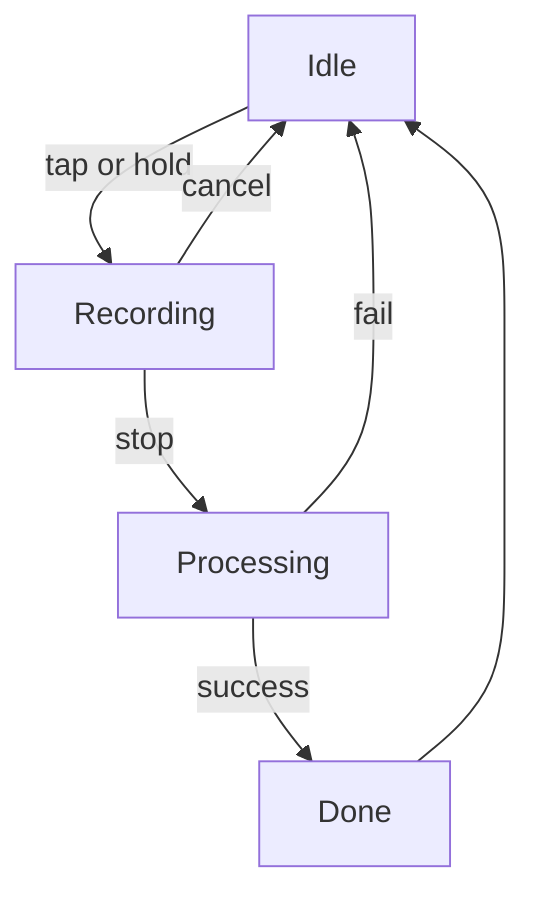
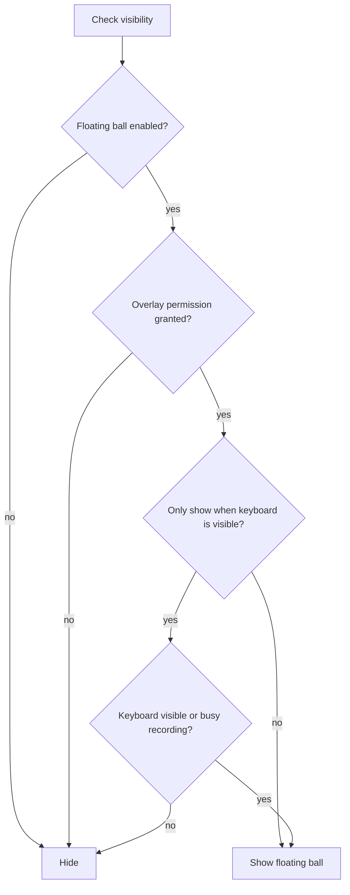
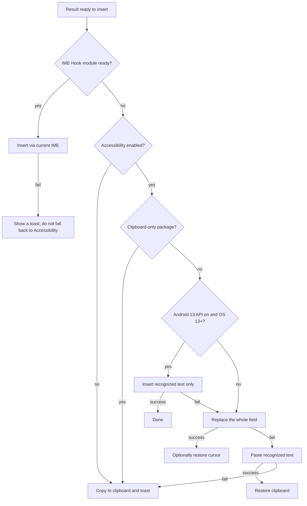

# Floating Ball

The floating ball lets you trigger BiBi Keyboard's voice recognition even when you are using other keyboards, enabling true cross-app voice input.

## Overview

The floating ball is a draggable circular button overlay. It provides:

- **Works with any IME**: use BiBi Keyboard ASR even when a third-party keyboard is active
- **Global**: available in any app (settings, browser, chat apps, etc.)
- **State indicator**: color/animation indicates current status
- **Free positioning**: drag anywhere; auto snap to screen edge
- **Edge semi-hidden handle**: when always visible and resting on an edge, it can collapse to an arrow handle to reduce obstruction
- **Stable across rotation**: remembers edge anchor so portrait/landscape switches keep edge side and relative position as much as possible

## States

| State          | Description                             |
| -------------- | --------------------------------------- |
| **Idle**       | waiting; tap/hold to start recording    |
| **Recording**  | recording audio with volume glow and peak ripples |
| **Processing** | recognizing; processing animation continues from the recording visual state |
| **Done**       | checkmark; result has been inserted     |

## Setup & Configuration

Floating-ball settings live under `Settings → Input → More Input Methods`, which is divided into three sections: "Floating Ball Settings", "Volume Key Recording Mode", and "Advanced".

### Floating Ball Settings

| Setting                              | Default | Description                             |
| ------------------------------------ | ------- | --------------------------------------- |
| Use floating ball for voice recognition | off  | master switch; the ball is hidden when off |
| Only show floating ball when keyboard is visible | on | hide automatically when the keyboard is hidden |
| Hold the floating ball to record     | off     | hold to record; release to stop         |
| Drag to move the floating ball       | on      | drag to reposition without entering move mode |
| Floating ball transparency           | `1.0`   | 0.2-1.0; lower values reduce obstruction |
| Floating ball size                   | `44dp`  | 28-96dp                                 |

#### Display & appearance

**Visibility condition** ("Only show floating ball when keyboard is visible"):

- On (default): show only when the keyboard panel is visible
- Off: always show; when keyboard hidden, it becomes semi-transparent and sticks to the edge

**Edge semi-hidden and anchor positioning**:

- After snapping to the left/right edge and staying idle, the floating ball can enter a semi-hidden state and show only an arrow handle; tap or drag the handle to expand quickly
- On portrait/landscape rotation, it tries to keep the original edge side and relative height to reduce unexpected jumps to center

#### Recording trigger

"Hold the floating ball to record" decides the trigger:

- Off (default): tap to start, then tap again to stop
- On: hold to start and release to stop. Dragging far enough toward the menu or move direction cancels that recording and performs the corresponding action

### Volume Key Recording Mode

If you prefer physical buttons, you can use volume keys to start or stop voice recognition while the keyboard is visible.

1. Open `Settings → Input → More Input Methods → Volume Key Recording Mode`
2. Enable "Use volume keys for voice recognition"
3. Choose an action mode:
   - Volume+ starts / stops recording
   - Volume- starts / stops recording
   - Volume+ starts, Volume- stops
   - Volume- starts, Volume+ stops
4. Optionally enable "Recording status reminder" and "Stop recording when keyboard disappears"

::: warning Permission note
Volume key recording uses the Accessibility Service to detect keyboard visibility and volume-key clicks.
:::

### Advanced

Located under `Settings → Input → More Input Methods → Advanced`, with three options:

- **Accessibility write compatibility optimization**: in apps you select, a placeholder is inserted before recording to reduce leftover hint text in the final result (see [How results are inserted](#how-results-are-inserted))
- **Use Android 13 Accessibility IME API** (shown on Android 13 and later only): works better in terminals, editors, and similar special cases; disables the compatibility optimization and streaming preview (see [How results are inserted](#how-results-are-inserted))
- **IME Hook module**: when the current third-party keyboard has a compatible LSPosed / LSPatch bridge module enabled, final floating-ball recognition text is inserted through that keyboard's own `InputConnection`, and keyboard visibility is reported by the keyboard itself. Best for apps that restrict accessibility insertion, or setups where third-party IME panel visibility should control the floating ball more accurately.

::: warning Advanced option
The IME Hook module requires an additional bridge module. It does not read existing input text. If the bridge is not ready, the floating ball continues using Accessibility insertion or clipboard fallback. See [IME Bridge Module](/en/advanced/ime-bridge) for downloads, LSPosed/LSPatch setup, scope configuration, and troubleshooting.
:::

**Record inside a bridged IME**: after enabling bridge text insertion, you can also enable "Record inside bridged IME". With an updated compatible LSPosed/LSPatch module, hold the control in the third-party keyboard to record; BiBi Keyboard then recognizes the audio using your current ASR and post-processing settings. See [IME Bridge Module](/en/advanced/ime-bridge#record-inside-a-third-party-ime) for the full procedure.

- In "IME Hook module status," confirm that the PCM recording area is shown as supported
- Focus a normal text field and keep the third-party keyboard open; sensitive fields are blocked
- If recording fails, it does not automatically switch to the floating ball or BiBi Keyboard's own microphone; trigger it again

## How results are inserted

Accessibility does not provide a true IME-style "insert text" API, and some apps (e.g. WeChat, QQ, some games) may restrict text input. Results actually follow the fallback chain below: when the IME Hook module is ready, the current keyboard inserts the text; otherwise Accessibility is used. A later step runs only if the previous one fails.

::: tip Tip
The compatibility optimization can reduce leftover hint text in some apps, but insertion still follows the fallback chain above and is not perfect. For best reliability, prefer the BiBi Keyboard IME, the IME Hook module, or Fcitx5 AIDL linking.
:::

## Keep-alive

If your device aggressively kills background services and the floating ball/accessibility gets reclaimed, enable keep-alive under `Settings → System → Other Settings → Keep-alive`:

- **Foreground keep-alive (recommended first)**: suitable for most users. It shows a persistent notification and improves background survival.
- **Persistent notification status**: after foreground keep-alive is enabled, the notification refreshes basic floating-service status so you can confirm it is still working.
- **Persistent notification tap**: after keep-alive is enabled, choose which settings page opens when you tap the persistent notification (Input, UI, Floating, ASR, AI, Recognition History, or Usage Stats). The default is Recognition History.
- **Shizuku / Root enhanced keep-alive (advanced)**: for devices that still kill the service even after foreground keep-alive. Prerequisites: foreground keep-alive is already enabled, and Shizuku authorization or a root environment is available.

::: warning Keep-alive risk note
Enhanced keep-alive depends on privileged capabilities (Shizuku or root). Enable it only if your device/security policy allows it. Some systems or enterprise policies may restrict this and it may increase battery usage.
:::

## Permissions

The floating ball requires the following system permissions:

### 1. Overlay permission

**Purpose**: show the floating ball over other apps.

**How to grant**:

1. When enabling the feature, the app jumps to system settings
2. Find BiBi Keyboard and allow "Display over other apps"

### 2. Accessibility permission

**Purpose**: insert recognition result into the active editor.

**How to grant**:

1. Settings → Accessibility
2. Enable "BiBi Keyboard speech accessibility service"

::: warning Privacy
BiBi Keyboard's accessibility service is **only used for text insertion**. It does not read screen content or collect sensitive info.
:::

::: info Insertion without accessibility
With the "IME Hook module" (LSPosed / LSPatch bridge module) installed and enabled, results can be inserted through the current keyboard, so no accessibility permission is needed; see [How results are inserted](#how-results-are-inserted).
:::

### 3. Microphone permission

**Purpose**: record audio.

**How to grant**:

1. On first use, Android shows a permission prompt
2. Tap "Allow"

::: info Android 14+
On newer Android versions, a microphone foreground-service notification may appear while the floating ball is recording. This is a system requirement for background microphone use and helps keep recording from being interrupted silently.
:::

## Usage

### Basic

1. **Start recording**:
   - Default: tap the floating ball to start; tap again to stop
   - Hold mode: hold to start; release to stop (enable in settings)
2. **Stop recording**:
   - Tap mode: tap again
   - Hold mode: release finger
3. **Cancel**:
   - Swipe up/left while holding (hold mode)
   - Long-press to cancel (tap mode)

### Advanced

- **Radial menu**: long-press and drag toward the screen center to open the menu; release on a menu item to trigger it. Items include:
  - switch AI polish prompt
  - switch ASR provider
  - switch IME
  - move floating ball
  - toggle auto-stop on silence
  - toggle AI polish
  - view recognition history
  - upload/pull clipboard (requires clipboard sync enabled)
  - settings
- **Drag**: by default you can drag to move directly. If "Drag to move" is disabled, long-press for ~2s (two vibration feedbacks) to enter move mode, or pick "Move floating ball" from the menu
- **Reset**: tap "Reset floating ball position" in settings

### Continuous speaking with floating ball <Badge type="warning" text="Pro" />

In Pro, continuous speaking mode can also run from the floating ball. When enabled, the floating ball listens locally, starts a segment when VAD detects speech, submits the segment after silence, and then keeps waiting for the next segment.

This is useful when you want continuous dictation in the current app without switching to the BiBi Keyboard panel. It keeps the microphone listening longer than normal hold/tap recording, so battery usage is higher; in noisy environments, switch back to normal recording mode.

## Common issues

### Floating ball not visible

Possible causes:

1. Overlay permission not granted
2. Master switch off → check `Settings → Input → More Input Methods → Floating Ball Settings → Use floating ball for voice recognition`
3. "Only show when keyboard is visible" enabled (you need to show keyboard first)
4. System battery optimization/background restrictions kill the app or its accessibility service
   - You can enable "Foreground keep-alive" under `Settings → System → Other Settings → Keep-alive`, and request battery whitelist

### Cannot insert text

Possible causes:

1. Accessibility permission not granted → check accessibility settings, or use the IME Hook module instead
2. The target app blocks accessibility text input → try enabling "Accessibility write compatibility optimization"

## Related

- [Voice Input Basics](./voice-input.md)
- [Recording Modes](./recording-modes.md)
- [AI Post-processing](./ai-postprocess.md)
- [Auto-stop on Silence (VAD)](./vad.md)
