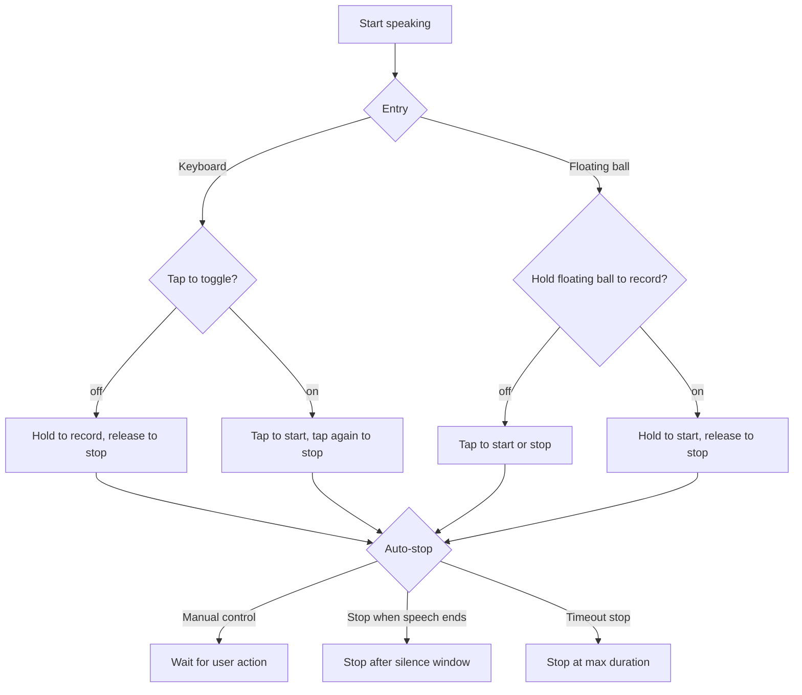

# Recording Modes

BiBi Keyboard provides two microphone trigger modes, plus optional auto-stop behavior for different workflows.

## Overview

| Mode             | How to trigger                               | Best for |
| ---------------- | -------------------------------------------- | -------- |
| **Press and hold** | hold the mic button to record; release to stop | classic IME feel; precise control |
| **Tap to toggle**  | tap the mic button to start/stop               | long dictation; hands-free |

Press-and-hold on the keyboard suppresses auto-stop on silence until you release. "Continuous recording while visible" reduces the startup delay after you press the mic; see [Continuous Recording While Visible](#continuous-recording-while-visible) below.

## Press and hold (default)

### How to use

1. **Start**: press and hold the mic button
2. **Continue**: keep holding
3. **Stop**: release finger

### Setting

- Path: `Settings → Input → Input Settings → Input Behavior → Tap to start/stop recording` (off by default, i.e. press-and-hold)

### Pros / cons

::: tip Pros

- ✅ intuitive; matches most keyboards
- ✅ precise control of duration
- ✅ quick stop on release
  :::

::: warning Cons

- ⚠️ finger fatigue for long recordings
- ⚠️ you must keep holding, hard to do other actions
  :::

### Gestures

- **Swipe left**: cancel recording
- **Swipe right**: send/commit recognition immediately
- **Swipe down**: temporarily lock recording (press-and-hold mode only)

## Tap to toggle

### How to use

1. **Start**: tap the mic button
2. **Continue**: hands-free recording
3. **Stop**: tap the mic button again

### Setting

- Path: `Settings → Input → Input Settings → Input Behavior → Tap to start/stop recording` (on)

### Pros / cons

::: tip Pros

- ✅ hands-free, good for long recording
- ✅ you can read/scroll while recording
- ✅ no finger pressure
- ✅ good for long dictation
  :::

::: warning Cons

- ⚠️ easy to forget to stop
- ⚠️ slightly higher accidental trigger risk
  :::

### Gestures

- **Swipe left**: cancel recording
- **Swipe right**: send/commit recognition immediately

### Recommended scenarios

- long dictation (articles, reports)
- meeting notes
- record while doing other actions

## Working with Other Features

### Recording auto-stop mode

Under `Settings → Smart → Speech Recognition Settings → Auto-stop on Silence → Recording auto-stop mode`, choose when recording should end automatically:

| Mode | Description | Best for |
| ---- | ----------- | -------- |
| **Manual control** | release the mic or tap it again to stop | precise manual control |
| **Stop when speech ends** | stop after you stop speaking for a while | daily input, short messages, chat |
| **Timeout stop** | stop when "Maximum recording duration" is reached | avoiding forgotten tap-to-toggle recordings |

"Timeout stop" does not detect speech; it only stops by duration. Use [Auto-stop on Silence](./vad.md) when you want recording to stop based on pauses.

### Continuous recording while visible

To make mic starts feel faster, enable `Settings → Input Settings → Continuous recording while visible`. When enabled, BiBi Keyboard records locally while the keyboard or floating ball is visible. Audio before you press the mic is not uploaded; it is used only to reduce startup latency after you trigger recognition.

::: warning Note
This keeps the microphone listening locally while the keyboard or floating ball is visible, which may increase battery usage. Keep it off if you are sensitive to privacy or power consumption.
:::

### Quick switch button

If you often switch between short messages and long dictation, add the "Recording mode switch" action to your keyboard layout:

1. Open `Settings → Input → UI Settings → Keyboard UI → Custom keyboard layout`
2. Pick an action-row or keyboard button position
3. Set its action to `Recording mode switch`
4. Return to the keyboard and tap it to switch between press-and-hold and tap-to-toggle recording

## Related

- [Auto-stop on Silence](./vad.md)
- [Floating Ball](./floating-ball.md)
- [Gestures](./gestures.md)

