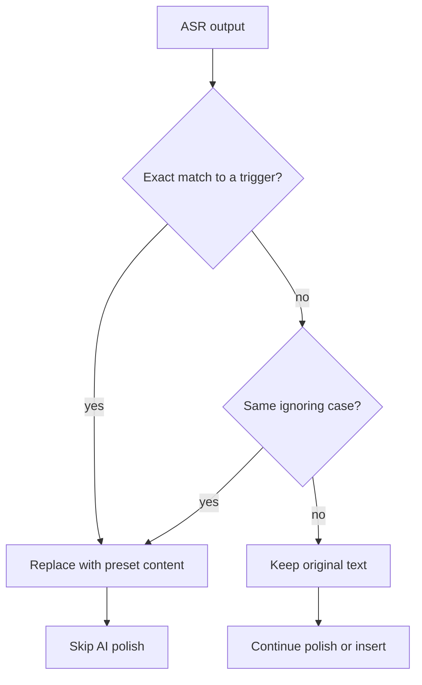

# Speech Presets

Speech presets let you create shortcut replacement rules for commonly used phrases. When the ASR result matches a trigger phrase, it is automatically replaced with your preset content, greatly improving repeated input efficiency.

::: info Naming note
The feature is called "Speech Presets" in the app and lives under `Settings → System → Other Settings → Speech Presets`. This page uses "speech presets" throughout.
:::

## Overview

### How it works



Logic:

1. Perform speech recognition normally
2. Match the transcript against preset triggers
3. If matched (exact or case-insensitive), replace with preset content
4. Otherwise keep original transcript

### Good for

::: tip Recommended

- ✅ common phrases: email, phone number, address
- ✅ canned replies: "OK", "Received", etc.
- ✅ terms: "ASR" → "Automatic Speech Recognition"
- ✅ long templates: signatures, disclaimers
- ✅ emoji combos: e.g. "haha" → "hahaha 😄"
  :::

## Data storage

Presets are stored locally on the device. Each preset = Name (trigger) + Content (replacement text).

| Item            | Description                                                  |
| --------------- | ------------------------------------------------------------ |
| Preset list     | all preset data, included in config backup export/import     |
| Current preset  | records the preset selected on the settings page; not used for matching |

## Usage

### Create a preset

1. Open `Settings → System → Other Settings → Speech Presets`
2. Tap "Add" — a new preset is created and selected automatically
3. Enter a trigger in "Preset name" (e.g. "my email")
4. Enter the full text in "Preset content" (e.g. "example@domain.com")
5. Edits are saved automatically

::: tip Naming tips

- Keep trigger phrases short and easy to say
- Make triggers unique to avoid conflicts
- Prefer consistent patterns like "my ___", "___ address", etc.
  :::

### Use a preset

1. Use voice input as usual
2. Speak a preset's Name (e.g. "my email")
3. The transcript is replaced with that preset's Content automatically
4. The final text is inserted into the editor

**Full flow example**:

```
You say: "my email"
  ↓ [ASR]
Transcript: "my email"
  ↓ [Preset match]
Hit preset: Name "my email" → Content "example@domain.com"
  ↓ [Replace]
Final output: "example@domain.com"
```

### Edit a preset

1. Open `Settings → System → Other Settings → Speech Presets`
2. Select the preset in the "Current preset" dropdown
3. Modify "Preset name" or "Preset content"; edits are saved automatically

### Delete a preset

1. Open `Settings → System → Other Settings → Speech Presets`
2. Select the preset in the "Current preset" dropdown
3. Tap "Delete" and confirm

## Matching rules

### Exact match first

1. **Exact match**: transcript equals the preset Name exactly (including spaces and case)
2. **Case-insensitive match**: same content but different case

### Examples

| Trigger       | Transcript       | Match | Type               |
| ------------ | ---------------- | ----- | ------------------ |
| "my email"   | "my email"       | ✅     | exact              |
| "my email"   | "my  email"      | ❌     | whitespace differs |
| "ASR"        | "asr"            | ✅     | case-insensitive   |
| "received"   | "received it"    | ❌     | not equal          |
| "ok"         | " ok "           | ✅     | trimmed spaces     |

## Practical examples

### Personal info

#### Contact details

```json
[
  {
    "name": "my email",
    "content": "your.email@example.com"
  },
  {
    "name": "my phone",
    "content": "13800138000"
  },
  {
    "name": "my address",
    "content": "Room XX, No. XX Road, Chaoyang District, Beijing"
  }
]
```

#### Social accounts

```json
[
  {
    "name": "my WeChat",
    "content": "wxid_1234567890"
  },
  {
    "name": "my Twitter",
    "content": "@YourTwitterHandle"
  },
  {
    "name": "my GitHub",
    "content": "https://github.com/yourusername"
  }
]
```

### Templates

#### Email signature

```json
[
  {
    "name": "email signature",
    "content": "Best regards,\\n\\nJohn Doe\\nSenior Engineer\\nACME Corp\\nPhone: +1-xxx\\nEmail: john@example.com"
  }
]
```

#### Disclaimer

```json
[
  {
    "name": "disclaimer",
    "content": "This message is for reference only and does not constitute investment advice."
  }
]
```

## How it interacts with other features

### With AI post-processing

Speech presets run **before** AI post-processing:

```
ASR → [speech preset replacement] → [AI post-processing] → insert
```

### With ASR providers

Speech presets are provider-agnostic:

- ✅ works for all providers
- ✅ works for cloud and local engines
- ✅ works for both streaming and non-streaming modes

Best practice: pick an accurate ASR provider so trigger phrases are recognized correctly.

### With floating ball

Floating ball voice input fully supports speech presets:

```
Floating ball recording → ASR → preset match → insert into active editor
```

## Notes

### Trigger design principles

::: warning Avoid conflicts

- ❌ avoid very common phrases (e.g. "ok", "thanks")
- ❌ avoid too-short triggers (single syllable)
- ❌ avoid conflicting replacements for common expressions
  :::

::: tip Recommended trigger design

- ✅ use fixed patterns ("my ___", "___ address")
- ✅ use proper nouns (company email, home address)
- ✅ use abbreviations (ASR, LLM)
- ✅ use unique phrases ("insert signature", "append disclaimer")
  :::

### Performance

- **Count**: matching walks the preset list one by one, so a very large list may slightly affect performance
- **Content length**: unlimited, but very long content may affect UX

### Data safety

- **Local storage**: all presets are stored on the device
- **Backup**: back up your presets regularly with the in-app backup feature
- **Privacy**: avoid storing sensitive information (e.g. passwords) in presets

## FAQ

### A preset does not trigger

Checklist:

1. ✅ the preset was added successfully (visible in the list)
2. ✅ the trigger phrase is spelled correctly
3. ✅ the transcript matches the preset Name (check spaces and punctuation)
4. ✅ the transcript is trimmed (no leading/trailing spaces)

Common causes:

- Transcript contains punctuation: "my email." does not match "my email"
- Transcript contains extra spaces: "my  email" does not match "my email"
- Case mismatch: handled automatically; if it does not work, please report a bug

## Related

- [Voice Input Basics](./voice-input.md) - how recognition works
- [AI Post-processing](./ai-postprocess.md) - what happens to preset content afterwards
