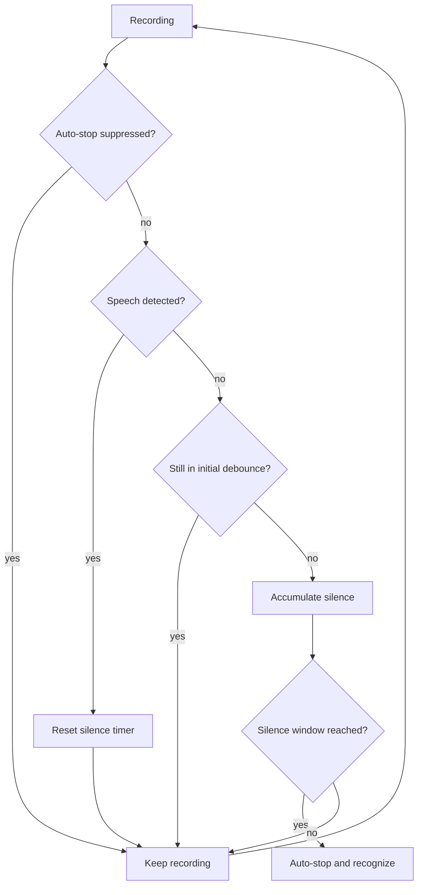

# Auto-stop on Silence

Auto-stop on silence stops recording automatically after you stop speaking, so you don't need to tap "stop" manually. Detection runs fully offline on your device (based on the Ten VAD model) and never uploads audio for this purpose.

## Overview

Auto-stop analyzes the recorded audio frame by frame in real time to detect whether you are speaking. The flow:

Core logic:

1. Analyze the recorded audio frame by frame in real time to detect whether you are speaking
2. Start a timer when silence is detected
3. When silence duration exceeds the "stop window" (1.2 s by default), stop recording and submit the audio for recognition automatically

Auto-stop is disabled in the following scenarios so recording does not end before you release:

- **Press-and-hold recording**: recording stops only when you release
- **AIDL sessions controlled by an external IME**: start/stop is controlled by the calling IME

Auto-stop works with all recognition modes: streaming recognition stops uploading the audio stream, while file-mode and local recognition submit the full audio.

## Recording Auto-stop Mode

When recording ends automatically is controlled by "Recording auto-stop mode" under `Settings → Smart → Speech Recognition Settings → Auto-stop on Silence → Recording auto-stop mode`. Choose one of three:

- **Manual control** (default): recording stops only when you release the mic or tap it again; nothing stops it automatically.
- **Stop when speech ends**: recording ends automatically after you stop speaking for a while. Good for daily input, short messages, and chat.
- **Timeout stop**: recording ends when the "Maximum recording duration" is reached. It does not detect speech and is useful to prevent forgotten tap-to-toggle recordings.

## Stop Parameters

The following two options are shown only when "Recording auto-stop mode" is "Stop when speech ends":

| Option | Description | Default |
| ------ | ----------- | ------- |
| Stop window (ms) | how long to wait after silence before stopping, 300–5000 ms | 1200 |
| Stop-recording sensitivity | 1–10; higher values stop sooner | 4 |

Sensitivity reference:

| Level | Description | Best for |
| ----- | ----------- | -------- |
| 1–3 Conservative | stops only when it is very confident | noisy environments; quiet voice; frequent pauses |
| 4–6 Balanced | balances accuracy and responsiveness | daily use, office/home |
| 7–10 Sensitive | quick response; small pauses may trigger stop | quiet environments; continuous speech; fast input |

### Recommended configs

- **Daily chat**: stop window 1000 ms, sensitivity 5 — stops after about 1 s of silence for quick responses.
- **Dictation / documents**: stop window 1500 ms, sensitivity 4 — allows short pauses for thinking without frequent false stops.
- **Meeting notes**: stop window 2000 ms, sensitivity 3 — avoids false stops when speakers pause; good for multi-person conversations.

## Maximum Recording Duration

Path: `Settings → Smart → Speech Recognition Settings → Auto-stop on Silence → Maximum recording duration`. Shown only when "Recording auto-stop mode" is "Timeout stop". Default is 120 seconds, adjustable from 30 to 600 seconds. Recording ends automatically (and is recognized) at this duration without any silence detection.

## Related Pre-recognition Options

The following two options live under `Settings → Input → Input Settings → Audio & External Link` and affect only non-streaming recognition (file upload or local full-audio inference); they do not change real-time streaming upload:

- **Auto discard invalid input**: after recording stops, the app checks locally whether the recording contains speech. If no speech is detected, the recording is discarded and never sent to the recognition provider, avoiding pointless requests.
- **Auto filter silent parts**: before recognition, silent parts are removed locally to shorten the audio and possibly reduce upload time. Useful for long recordings with obvious pauses.

::: warning Note
Both options are off by default. In noisy environments, with quiet speech, or when you pause for a long time, enable them carefully to avoid skipping or trimming useful speech.
:::

## Troubleshooting

### Auto-stop never triggers

- Make sure "Recording auto-stop mode" is set to "Stop when speech ends"; other modes never stop by silence.
- Background noise (fans, air conditioning, keyboard sounds) may be mistaken for speech. Try a lower "Stop-recording sensitivity".
- Your pause must exceed the "Stop window"; try a smaller value.

### Stops unexpectedly while speaking

- Long pauses, a quiet voice, or being far from the mic can trigger false stops.
- Lower the "Stop-recording sensitivity" (e.g. 3) or raise the "Stop window" (e.g. 2000 ms).

### Background noise prevents stopping

- Move to a quieter environment, or use a directional mic / noise-canceling headset.
- Lower the "Stop-recording sensitivity" (e.g. 2), or switch to "Manual control" for now.

### Feels too slow after you stop speaking

- Usually the "Stop window" is too long. For fast input, lower it to around 1000 ms (may stop more eagerly).
- See "Recommended configs" above for a balanced setup per scenario.

## Related

- [Recording Modes](./recording-modes.md) - recording trigger styles that pair with auto-stop
- [Voice Input Basics](./voice-input.md) - how recognition works
- [Floating Ball](./floating-ball.md) - auto-stop in the floating ball
