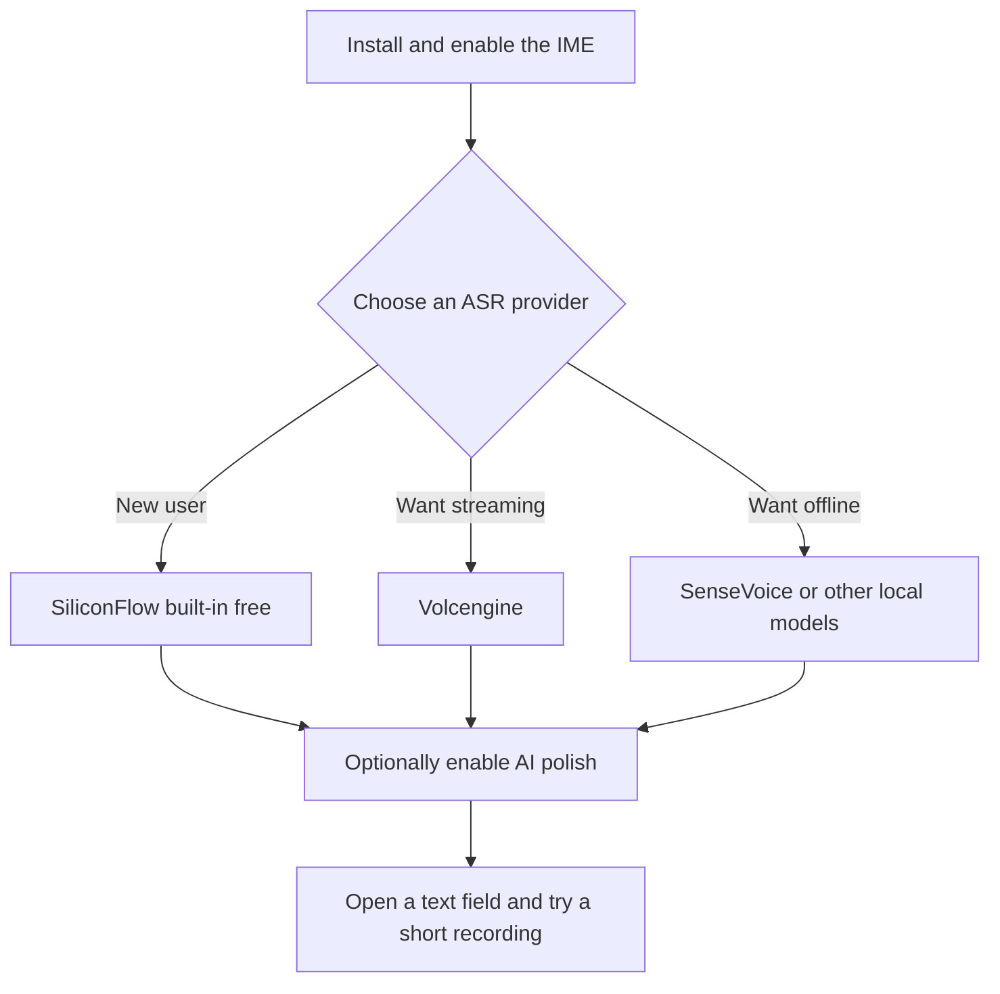

# First Setup

After installing BiBi Keyboard (说点啥), you need to configure an ASR provider before you can start using voice recognition. New users will see a basic onboarding guide and recommended setup options on first launch. This page covers the full setup flow and some common tweaks.

## Choose an ASR Provider

BiBi Keyboard supports 18 ASR providers, including cloud services and local models. For the first setup, these are recommended:

### Recommended Options

| Provider         | Type  | Free/Pricing                         | Pros                                                  | Best for |
| ---------------- | ----- | ------------------------------------ | ----------------------------------------------------- | -------- |
| **SiliconFlow**  | Cloud | built-in free ASR/LLM service         | no extra config; 5 built-in free recognition models (SenseVoiceSmall etc.) | New users |
| **Volcengine**   | Cloud | usually includes free quota for new users (see console) | streaming transcription with real-time output          | Low-latency experience |
| **SenseVoice**   | Local | fully offline, no API cost            | offline + privacy; supports pseudo-streaming preview   | Privacy-first |

::: tip For beginners
If this is your first time, start with **SiliconFlow**. The app enables the built-in free ASR/LLM by default, so you can try it without signup or API keys.
:::

For other providers (Volcengine, DashScope, Soniox, Gemini, ElevenLabs, OpenAI, StepAudio, Zhipu, and local models), see [ASR Provider Setup](/en/getting-started/asr-providers).

::: tip Provider grouping
In ASR and AI post-processing settings, providers are grouped by "configured" and "not configured". Providers with valid keys or installed local models appear first, making daily switching easier.
:::

## Configure SiliconFlow (Recommended)

Below uses SiliconFlow as an example.

If you only want to try the built-in free ASR/LLM service, simply select "SiliconFlow" as the provider in-app, keep the "Free ASR/LLM" toggles enabled, and you do NOT need to register or fill in an API key.

The steps below are mainly for advanced users who want to use **their own API key**.

### 1. Create a SiliconFlow account

1. Visit https://cloud.siliconflow.cn/
2. Click Sign up / Log in
3. Register with phone/email
4. Enter the console after login

### 2. Get an API key

1. In the console, open "API Keys"
2. Click "Create new key"
3. Name it (e.g. "BiBi Keyboard") and confirm
4. Copy the generated key (usually starts with `sk-`)

::: warning Security note
API keys are sensitive. Do not share them. If leaked, delete the key immediately and create a new one.
:::

### 3. Configure in BiBi Keyboard

1. Open BiBi Keyboard and tap the Settings button (gear icon) above the keyboard
2. Go to "Speech Recognition Settings"
3. Under "Speech Recognition Provider", choose "SiliconFlow"
4. Paste the API key
5. Tap "Save" or just go back

### 4. Configure AI post-processing (Optional)

SiliconFlow also provides LLM services for AI post-processing:

1. Go to "AI Feature Settings"
2. Enable "AI post-processing"
3. Choose "SiliconFlow" as the LLM provider
4. Use the same API key (shared with ASR)
5. Choose a model or input a custom model ID
6. Save

::: tip AI post-processing
AI post-processing can add punctuation, fix recognition mistakes, and improve tone based on your prompt. For better UX, pick a faster model.
:::

## Test Voice Input

Once configured, let's test that voice recognition works:

1. **Open a text field**: open any app that supports text input.
2. **Record**: make sure the current IME is BiBi Keyboard, **press and hold** the microphone button (the big button), speak, then **release** and wait for the transcript.
3. **Check the result**: if configured correctly, text will be inserted into the input field; if something fails, the error message will be copied to clipboard.

### Error checks

If something fails, check:

- whether the API key is correct
- network connectivity
- microphone permission
- whether audio is captured (watch waveform / volume indicator)

## Basic Tweaks

### Keyboard recording start/stop

1. Open `Settings → Input → Input Settings → Input Behavior`
2. Toggle "Tap to start/stop recording" as needed:
   - **Off** (default): press and hold to record, release to stop
   - **On**: tap to start, tap again to stop

### Auto-stop on silence

When "Stop when speech ends" is selected, the app stops recording automatically after no speech is detected for a given window. If your recordings are often cut off by pauses, or stopping feels too slow, adjust the auto-stop settings:

1. Open `Settings → Smart → Speech Recognition Settings → Auto-stop on Silence`
2. Choose "Recording auto-stop mode": **Manual control** / **Stop when speech ends** / **Timeout stop**
3. Tune "Stop window (ms)" (300-5000, default 1200)
4. Tune "Stop-recording sensitivity" (1-10; higher stops sooner, default 4)

::: tip Auto-stop tips

- If it stops too easily, increase the stop window or lower the sensitivity.
- If it stops too slowly, decrease the stop window or raise the sensitivity.
  :::

### Keyboard scale

1. Open `Settings → Input → UI Settings → Keyboard UI`
2. Choose "Keyboard scale":
   - **Small**
   - **Medium** (default)
   - **Large**
3. Adjust bottom padding if needed

## Troubleshooting

### No recognition / failed recognition

1. Check microphone permission
2. Verify the API key
3. Check network connectivity (for cloud ASR)
4. Read the error message and follow the suggestion

### Low accuracy

1. Switch to another ASR provider
2. Enable AI post-processing
3. Use a quieter environment
4. Speak clearly at a moderate pace

### API key invalid

1. Re-copy the key (ensure it is complete)
2. Confirm the key is not expired/deleted
3. Check quota/billing in the provider console
4. Create a new key if needed

### Quota exceeded / rate limited

1. Check quota and billing rules in the provider console
2. To reduce costs, switch to the built-in free option (e.g. SiliconFlow free service) or local models (SenseVoice/FunASR Nano/Qwen3-ASR/X-ASR/etc.)
3. To keep using the same cloud provider, upgrade plan or recharge per console guidance

## Next

- Explore [Features](../features/voice-input) to understand all capabilities
