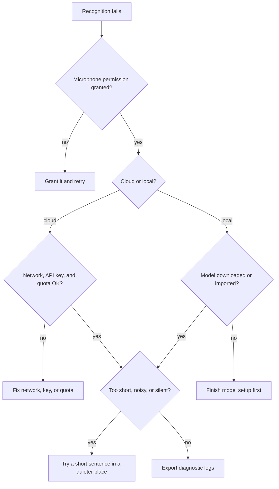

# FAQ

This page collects common BiBi Keyboard issues and practical troubleshooting steps.

## Voice recognition fails

1. Check microphone permission.
2. For cloud ASR, confirm network connectivity, API key validity, and account quota.
3. For local models, confirm the model has been downloaded or imported.
4. Test with a short sentence to rule out very short audio, noisy environments, or no audio input.

## How do I export diagnostic logs?

BiBi Keyboard records basic diagnostic information to help troubleshoot crashes, recording failures, and model-loading problems.

1. Open `Settings → About`
2. Find the diagnostic log entry
3. Export logs and attach them when reporting an issue

## Local models are slow on first recognition

Local models need to be loaded into memory the first time they run. The delay depends on device performance and model size. In the local model settings, enable "Aggressive model loading" to prepare the model when the keyboard or floating ball appears, and use "Model unload policy" to control how long the model stays in memory after recognition (keep never / 5 / 15 / 30 minutes / always), avoiding repeated loads.

## OpenAI Realtime has no streaming output

In the OpenAI ASR channel, enable "Streaming recognition" (Realtime), and make sure the endpoint supports the Realtime API. Some compatible services only support `/v1/audio/transcriptions` file transcription.

## The modified IME / IME Bridge does not work

1. Check the "IME Hook module status" under `Settings → Input → More Input Methods → Advanced`; tap the status to refresh it
2. Make sure the LSPosed scope selects only the target keyboard, then force-stop and reopen it (reboot if needed); with LSPatch, patch the keyboard again after it is updated

See [IME Bridge Module](/en/advanced/ime-bridge).

## AIDL linking reports unauthorized (403)?

A 403 usually means the linking switch in BiBi Keyboard is off: open `Settings → Input → Input Settings → Audio & External Link` and enable "Allow external IME linking (AIDL)", then retry. See [External IME Linking (AIDL)](/en/advanced/aidl-integration).

## Floating ball disappears often

Some systems reclaim background or accessibility services aggressively. First enable foreground keep-alive under `Settings → Other Settings` and request battery whitelist. If your device still kills it, consider Shizuku / Root enhanced keep-alive.
