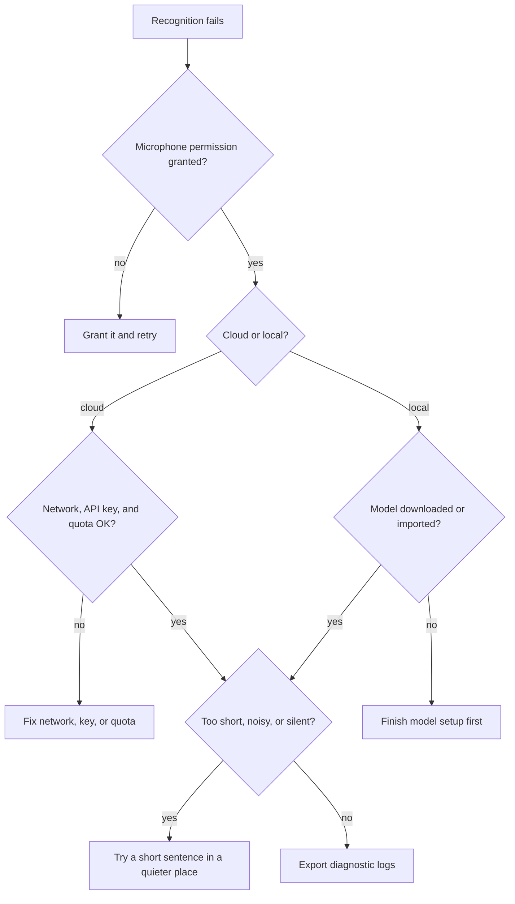

# FAQ

This page collects common BiBi Keyboard issues and practical troubleshooting steps.

## Voice recognition fails

1. Check microphone permission.
2. For cloud ASR, confirm network connectivity, API key validity, and account quota.
3. For local models, confirm the model has been downloaded or imported.
4. Test with a short sentence to rule out very short audio, noisy environments, or no audio input.

## How do I export diagnostic logs?

BiBi Keyboard records basic diagnostic information to help troubleshoot crashes, recording failures, and model-loading problems.

1. Open `Settings → About`
2. Find the diagnostic log entry
3. Export logs and attach them when reporting an issue

## Local models are slow on first recognition

Local models need to be loaded into memory the first time they run. The delay depends on device performance and model size. In the local model settings, enable "Load model on first show" or increase "Model keep-alive duration" to prepare the model when the keyboard or floating ball appears.

## OpenAI Realtime has no streaming output

In the OpenAI ASR channel, enable "Streaming (Realtime)", and make sure the endpoint supports the Realtime API. Some compatible services only support `/v1/audio/transcriptions` file transcription.

## Floating ball disappears often

Some systems reclaim background or accessibility services aggressively. First enable foreground keep-alive under `Settings → Other Settings` and request battery whitelist. If your device still kills it, consider Shizuku / Root enhanced keep-alive.
