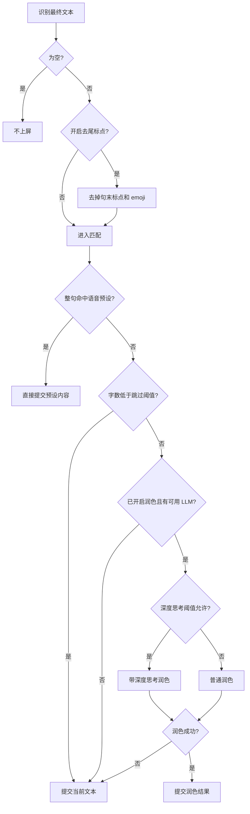

# AI 后处理

AI 后处理功能使用大型语言模型（LLM）对 ASR 识别结果进行智能优化，包括去除语气词、修正错别字、调整标点、改写润色等，让语音输入更加流畅自然。

::: info 名称说明
自 v4.4.2 起，应用内的设置入口为 `设置 → 智能 → AI 功能设置`，界面文案中也将「AI 后处理」统一称为「AI 润色」。两者指同一功能。
:::

## 快速配置指南

### 使用免费服务（推荐）

说点啥默认配置了 **SiliconFlow 免费服务**，无需 API Key 即可使用：

1. 进入 `设置 → 智能 → AI 功能设置`
2. 开启"启用 AI 后处理"开关
3. 确认供应商为 **SF_FREE**（默认）
4. 选择 Prompt 预设（推荐"通用后处理"）
5. 在说点啥键盘上点击魔法棒按钮启用 AI 后处理模式
6. 完成！现在语音输入会自动进行 AI 优化

::: tip 免费服务说明

- 有一定免费额度（具体见 SiliconFlow 官网）
- 可选模型：Qwen/Qwen3-8B、THUDM/GLM-4-9B 等
- 如需其他模型，可注册 SiliconFlow 账号领取 14 元赠金并使用自己的 API Key
  :::

### 配置付费供应商

以 DeepSeek 为例：

1. 访问 [DeepSeek 平台](https://platform.deepseek.com/)注册账号
2. 创建 API Key 并充值
3. 在说点啥 `设置 → 智能 → AI 功能设置` 中：
   - 选择供应商：**DEEPSEEK**
   - 填入 API Key
   - 选择模型（如 deepseek-v4-flash）
   - 调整温度（默认 1.0）
4. 保存并测试

### 配置自定义供应商

对于任何 OpenAI 兼容的 API：

1. 在 `设置 → 智能 → AI 功能设置` 中选择供应商：**CUSTOM**
2. 填写完整配置：
   - **端点**：如 `https://your-api.com/v1`
   - **API Key**：您的密钥
   - **模型**：如 `gpt-5-luna`
   - **温度**：默认 1.0
3. 保存并测试

::: warning 自定义端点要求

- 必须兼容 OpenAI Chat Completions API 格式
- 端点路径通常为 `/v1/chat/completions`（会自动拼接）
  :::

## 功能说明

### 工作流程

图中「深度思考阈值允许」一步由「深度思考字数阈值」滑条控制，详见下文[深度思考与推理参数](#深度思考与推理参数)。

## 流式输出预览与打字机效果

当 LLM 供应商支持流式输出时，AI 后处理会在处理过程中**逐步显示结果预览**（所见即所得）。您可以在 `设置 → 智能 → AI 功能设置` 中开启/关闭「后处理打字机效果」，让预览输出更平滑。

::: info 说明
打字机效果仅影响“流式预览”的展示方式，不影响最终提交到输入框的文本内容。关闭打字机效果后，会在润色完成时一次性提交最终文本。
:::

## 超时与中断行为

- **润色超时**：AI 后处理有超时上限，超时后不会一直等待，会以原文提交。
- **取消不再回退**：手动取消润色后不会错误地再走一次非流式请求。
- **收起键盘即中断**：隐藏键盘时会取消进行中的 AI 润色并提交原文，避免下次按麦克风无响应。

## 使用方式

AI 润色有多种触发方式：

| 触发方式             | 说明                                                                             | 适用场景                 |
| -------------------- | -------------------------------------------------------------------------------- | ------------------------ |
| **自动润色**         | 开启「启用 AI 后处理」总开关后，每次语音输入自动执行                              | 日常使用，输出即最终结果 |
| **键盘「AI润色」键** | 点击键盘上的「AI润色」按钮，对本次识别结果手动执行润色                           | 临时需要润色某次识别     |
| **AI 编辑面板**      | 手动选择文本，点击键盘左侧的铅笔图标进入编辑面板。点击魔法棒按钮选择应用的提示词 | 需要反复调整或多次尝试   |
| **识别历史重新润色** | 在识别历史中对某条记录重新润色                                                   | 对历史结果换 Prompt 重试 |

## 适用场景

::: tip 推荐使用场景

- **口语转书面**：会议记录、报告撰写
- **长文本输入**：减少后期修改工作量
- **专业内容**：需要规范表达的场景
- **多语言**：结合翻译 Prompt 实现语音跨语言输入
  :::

::: warning 不建议场景

- 聊天对话（保持口语化更自然）
- 极短文本（如单个词语、数字）
- 对延迟敏感的场景
  :::

## Prompt 预设系统

说点啥内置 5 个常用 Prompt 预设，并支持自定义：

### 内置预设

| 预设名称         | 用途         | 效果                           |
| ---------------- | ------------ | ------------------------------ |
| **通用后处理**   | 日常语音输入 | 去除语气词、修正口误、保持原意 |
| **基础文本润色** | 书面化改写   | 修正语法、添加标点、流畅表达   |
| **翻译为英文**   | 跨语言输入   | 将识别文本翻译为英文           |
| **提取关键要点** | 会议记录     | 提取核心信息为无序列表         |
| **提取待办事项** | 任务管理     | 识别任务项并生成 checklist     |

### 自定义 Prompt

您可以在 `设置 → 智能 → AI 功能设置 → 润色 Prompt 预设` 中：

1. 点击"新增预设"创建新 Prompt
2. 编写 Prompt 内容（建议包含角色、任务、规则、输出要求）
3. 保存并在 AI 编辑面板中快速应用

### AI 编辑系统提示词

AI 编辑面板使用独立的系统提示词来理解“按指令修改当前文本”的任务。可在 `设置 → 智能 → AI 功能设置 → AI 编辑系统提示词` 中自定义；留空时使用应用内默认提示词。

建议只修改角色、约束和输出格式等长期规则。一次性的编辑要求（例如“翻译成英文并简化”）仍应在 AI 编辑面板中通过语音指令说出。

## 深度思考与推理参数

### 深度思考字数阈值

在 `设置 → 智能 → AI 功能设置` 中，可以通过「深度思考字数阈值」滑条，按**本次识别文本的字数**决定是否让模型进行深度思考：

| 滑条位置           | 行为                                                       |
| ------------------ | ---------------------------------------------------------- |
| 最左端（启用）     | 永久启用深度思考                                           |
| 中间值             | 识别文本字数超过阈值时才启用，短文本直接输出以降低延迟     |
| 最右端（不启用）   | 永不启用深度思考                                           |

阈值按每个 LLM 供应商分别保存。此前使用旧版「启用深度思考」开关的配置会自动迁移：原开关开启对应「永久启用」，关闭对应「永不启用」。

::: tip 使用建议
日常短句无需深度思考，保持直出响应更快；长文本改写、待办提取等复杂任务可把阈值调低，让模型只在内容较多时进行思考。
:::

### 支持推理的供应商

部分供应商支持"推理模式"（Thinking/Reasoning），模型会先进行深度思考再输出结果，适合复杂的文本处理任务，但通常会增加处理时间和 Token 消耗。不同供应商的控制方式不同，是否真正启用推理由上文「深度思考字数阈值」滑条决定；仅当所选模型支持推理且阈值允许时，才会附加推理参数。

### 自定义推理参数（JSON）

部分供应商的「推理模式」会提供"推理开启参数（JSON）/推理关闭参数（JSON）"输入框，用于在不同模式下附加高级参数：

- 不确定就留空（使用默认即可）
- 必须是合法 JSON 对象（示例：`{"reasoning_effort":"medium"}`）
- 参数名以各供应商官方文档为准

### 适用场景建议

推理模式适合复杂文本改写（如专业术语转换）、需要逻辑推理的任务（如提取待办事项）和多步骤处理（如翻译+润色）；简单的去除语气词不需要推理，开启只会增加延迟。

## 供应商与模型

说点啥支持 **13 个** LLM 供应商，所有供应商均使用 OpenAI 兼容的 API 格式：

在设置页选择 LLM 供应商时，已填写密钥或已可用的供应商会优先显示在“已配置”分组中，未配置的供应商会放在后面，便于快速切换。

| 供应商                          | 注册链接                                                 |
| ------------------------------- | -------------------------------------------------------- |
| **SF_FREE** 硅基流动免费服务 | [立即使用](https://cloud.siliconflow.cn/i/g8thUcWa)      |
| **DEEPSEEK** 深度求索        | [注册](https://platform.deepseek.com/)                   |
| **ZHIPU** 智谱               | [注册](https://bigmodel.cn/usercenter/proj-mgmt/apikeys) |
| **MOONSHOT** 月之暗面        | [注册](https://platform.moonshot.cn/console/api-keys)    |
| **VOLCENGINE** 火山引擎      | [注册](https://console.volcengine.com/ark)               |
| **DASHSCOPE** 阿里云百炼     | [注册](https://dashscope.aliyun.com/)                    |
| **OPENAI**                      | [注册](https://platform.openai.com/signup)               |
| **GEMINI** Google            | [注册](https://aistudio.google.com/apikey)               |
| **GROQ**                        | [注册](https://console.groq.com/keys)                    |
| **CEREBRAS**                    | [注册](https://cloud.cerebras.ai/platform)               |
| **FIREWORKS**                   | [注册](https://fireworks.ai/login)                       |
| **OHMYGPT**                     | [注册](https://x.dogenet.win/i/CXuHm49s)                 |
| **CUSTOM** 自定义            | -                                                        |

在 `设置 → 智能 → AI 功能设置` 中，您可以通过「获取模型列表」从供应商拉取可用模型，并将常用模型添加到应用内的下拉选择中。

在「测试」过程中可随时取消当前请求，便于快速调整配置并重新测试。测试成功时会展示分段耗时，方便判断慢在哪一步：

- **流式输出**：是否支持流式（不支持时按非流式返回）
- **连接建立 / 响应头 / 首个可见文本 / 输出**：各阶段耗时与合计耗时
- **连接复用**：本次测试是新建连接还是复用了已有连接

::: tip 提示
对于 **CUSTOM（自定义）** 供应商，如果您的服务端有默认模型，也可以不填写模型名；若测试调用失败，再按服务商要求填写即可。
:::

## Pro 功能

以下功能仅在 Pro 版中可用。

### AI 助手 <Badge type="warning" text="Pro" />

AI 助手可根据唤醒词和关键词自动匹配预设模式，并应用对应的 AI 后处理 Prompt。识别文本句首出现唤醒词时（默认唤醒词随应用语言本地化，中文为「点点」，英文界面为 "BB"），自动进入 AI 助手流程。

- **预设模式**：可配置多套预设并**同时启用**，不同场景绑定不同的 Prompt 预设
- **关键词匹配**：按预设关键词自动选择最合适的处理模式
- **模糊匹配**：支持唤醒词与预设关键词的模糊匹配，口语化表达也能触发
- **可自定义**：支持自定义唤醒词、关键词和各模式对应的 Prompt 规则

### 应用专属 Prompt <Badge type="warning" text="Pro" />

Pro 版可为不同前台应用分别绑定润色 Prompt：指定应用（如聊天软件、浏览器）在前台时，录音识别后的 AI 润色会自动套用该应用对应的 Prompt 预设，无需每次手动切换。

### 输入框上下文辅助 <Badge type="warning" text="Pro" />

在主键盘录音时，Pro 版可把光标附近的输入框文本作为参考发送给 AI 后处理，让模型更容易衔接上下文、保持术语和语气一致。启用 IME Bridge 的悬浮球录音也可使用该上下文能力。

::: warning 隐私说明
输入框上下文只用于 AI 后处理参考，适合在信任当前 LLM 供应商时开启。AI 的最终输出仍应只包含本次 ASR 文本的处理结果。
:::

### 热词增强 <Badge type="warning" text="Pro" />

Pro 版热词可在开启「向识别引擎注入热词」后按供应商能力参与识别，也可独立开启「识别后替换读音近似词」，在识别结束后按音素相似性做兜底替换。
目标词固定作为一个别名，还可额外添加两个别名；目标词和别名都会参与音素匹配，命中后统一替换为目标词。

示例：热词「音素」可添加别名「因素」「严肃」，识别到「因素」时替换为「音素」；也可以把热词设为 `xxxx@qq.com`，别名设为「主邮箱」，实现快捷短语输入。

## 故障排查

### AI 后处理不生效

**检查清单**：

1. ✅ 润色模式总开关已开启（`设置 → 智能 → AI 功能设置 → 启用 AI 后处理`）
2. ✅ 输入文本字数达到「少于特定字数时跳过 AI 后处理」的阈值
3. ✅ 供应商配置正确（API Key 有效）
4. ✅ 网络连接正常
5. ✅ API 额度未耗尽

### 输出结果不符合预期

**可能原因**：

- Prompt 不够明确 → 添加详细示例
- 温度过高 → 降低到 0.2
- 模型选择不当 → 尝试更强大的模型
- 输入文本过长 → 检查是否超出模型上下文限制

### 处理速度慢

**优化方案**：

1. 切换到更快的供应商（Groq、Cerebras）
2. 使用更小的模型（如 Qwen3-8B 而非 Qwen3-235B）
3. 关闭深度思考
4. 简化 Prompt 内容

## 相关功能

- [语音输入基础](./voice-input.md) - 了解 ASR 识别流程
- [键盘布局与按钮](./keyboard-layout.md#ai-编辑面板) - AI 编辑面板入口与按钮说明
