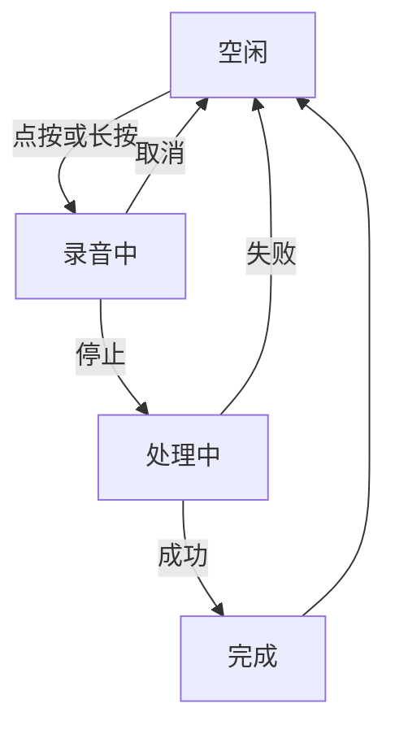
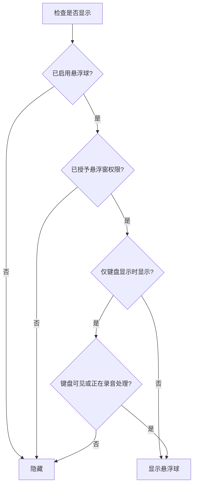
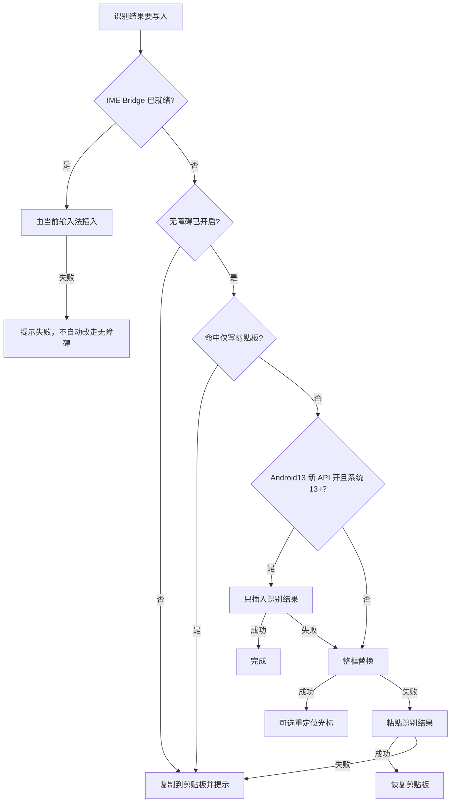

# 悬浮球功能

悬浮球功能让您可以在使用其他输入法时，依然能够通过悬浮球快速调用说点啥的语音识别能力，实现真正的跨应用语音输入。

## 功能介绍

悬浮球是一个可拖动的圆形按钮，悬浮在屏幕上方，提供以下功能：

- **跨输入法使用**：即使使用第三方输入法（如搜狗、百度输入法），也能调用说点啥语音识别
- **全局可用**：在任何应用中都能使用，包括系统设置、浏览器、聊天软件等
- **状态指示**：通过颜色变化实时显示工作状态
- **自由定位**：可拖动到屏幕任意位置，自动贴边
- **贴边半隐把手**：悬浮球常显状态下，贴边静置后会半隐，仅保留箭头把手，减少遮挡
- **横竖屏位置稳定**：记忆贴边锚点，旋转屏幕后尽量保持原有贴边方向与相对位置

## 状态指示

悬浮球通过动画和图标显示当前工作状态：

| 状态       | 说明                         |
| ---------- | ---------------------------- |
| **空闲**   | 等待用户触发，可点击开始录音 |
| **录音中** | 正在录制语音，随音量显示光晕和峰值波纹 |
| **处理中** | 语音识别进行中，处理动画与录音视觉状态衔接 |
| **完成**   | 对钩表示识别成功，结果已提交 |

## 配置选项

悬浮球基础配置位于 `设置 → 界面与交互 → 悬浮球设置`：

| 配置项                               | 类型    | 默认值 | 说明                                 |
| ------------------------------------ | ------- | ------ | ------------------------------------ |
| `floatingAsrEnabled`                 | Boolean | `true` | 启用语音识别悬浮球                   |
| `floatingSwitcherOnlyWhenImeVisible` | Boolean | `true` | 仅在键盘显示时显示悬浮球             |
| `floatingSwitcherAlpha`              | Float   | `1.0`  | 悬浮球透明度（0.2-1.0）              |
| `floatingBallSizeDp`                 | Int     | `44`   | 悬浮球大小（28-96dp）                |
| `floatingBallHoldToRecordEnabled`    | Boolean | `false` | 长按悬浮球录音，松手停止             |
| `floatingBallDirectDragEnabled`      | Boolean | `true` | 直接拖动移动（无需长按进入移动模式） |
| `floatingWriteTextCompatEnabled`     | Boolean | `true` | 无障碍写入兼容优化（指定应用里录音前占位） |
| `floatingImeBridgeEnabled`           | Boolean | `false` | 输入法桥接模式（需兼容 LSPosed / LSPatch 模块） |
| `imeBridgePcmRecordingEnabled`       | Boolean | `false` | 在兼容的桥接输入法内长按录音         |

### 稳定性（可选）

如设备省电策略较强、悬浮球或无障碍服务容易被系统回收，可在 `设置 → 其他设置` 中按需开启保活能力：

| 配置项                               | 类型    | 默认值  | 说明                                            |
| ------------------------------------ | ------- | ------- | ----------------------------------------------- |
| `floatingKeepAliveEnabled`           | Boolean | `false` | 前台服务保活（并可一键申请电池优化白名单）      |
| `floatingKeepAlivePrivilegedEnabled` | Boolean | `false` | Shizuku / Root 增强保活（需先开启前台服务保活） |

- **前台服务保活（推荐先开）**：适合大多数用户。开启后会显示常驻通知，并提升悬浮球后台存活率。
- **常驻通知信息**：开启前台服务保活后，通知会实时刷新悬浮服务的基础状态，便于确认保活是否仍在工作。
- **点击常驻通知跳转**：开启保活后，可在 `设置 → 其他设置 → 点击常驻通知跳转` 中选择点击常驻通知打开的页面（输入、界面、悬浮、语音识别、AI、识别历史、使用统计），默认识别历史。
- **Shizuku / Root 增强保活（进阶）**：适合系统管控严格、前台保活后仍易掉线的机型。前置条件为“已开启前台服务保活”，且已具备 Shizuku 授权或 root 环境。

::: warning 保活风险提示
增强保活依赖高权限能力（Shizuku 或 root）。请确认设备安全策略允许后再开启；部分系统或企业策略可能限制此类能力，且可能带来额外耗电。
:::

### 详细说明

#### 1. 启用语音识别悬浮球

- **路径**：`设置 → 界面与交互 → 悬浮球设置 → 启用语音识别`
- **说明**：总开关，关闭后悬浮球完全隐藏

#### 2. 显示条件

- **路径**：`设置 → 界面与交互 → 悬浮球设置 → 仅在键盘显示时显示`
- **说明**：
  - 开启（默认）：仅当键盘面板显示时，悬浮球才出现
  - 关闭：悬浮球持续显示，键盘隐藏时半透明贴边

#### 3. 透明度调节

- **路径**：`设置 → 界面与交互 → 悬浮球设置 → 透明度`
- **范围**：0.2（20%透明）- 1.0（完全不透明）
- **说明**：降低透明度可减少遮挡屏幕内容

#### 4. 大小调节

- **路径**：`设置 → 界面与交互 → 悬浮球设置 → 大小`
- **范围**：28dp（最小）- 96dp（最大）
- **默认**：44dp
- **说明**：根据屏幕尺寸和使用习惯自定义大小

#### 5. 悬浮球录音触发方式

- **路径**：`设置 → 界面与交互 → 悬浮球设置 → 长按悬浮球录音`
- **关闭（默认）**：点按开始，再次点按停止
- **开启**：长按开始，松手停止；向菜单方向或移动方向拖动超过阈值时，会取消本轮录音并执行对应操作

#### 6. 兼容模式

- **路径**：`设置 → 界面与交互 → 悬浮球设置 → 无障碍写入文字兼容优化`
- **说明**：
  - 开启（默认）：在你指定的应用中，录音前先写入占位，减少提示文字混入最终结果
  - 关闭：不做录音前占位。识别结果仍按下方写入回退链写入，并不是改用另一套「标准 IME API」
  - 开启「使用 Android 13 新版 API」后，兼容占位会自动失效

#### 7. 输入法桥接模式

- **路径**：`设置 → 界面与交互 → 悬浮球设置 → 输入法桥接模式`
- **说明**：当当前第三方输入法中安装并启用了兼容的 LSPosed / LSPatch 桥接模块时，悬浮球最终识别文字会通过该输入法自己的 `InputConnection` 写入，键盘显示状态也由输入法自身报告。
- **适用场景**：目标应用限制无障碍写入、或希望用第三方输入法面板状态更准确地控制悬浮球显示。

::: warning 进阶选项
输入法桥接模式需要额外安装并启用对应桥接模块。它不会读取已有输入内容；如桥接状态显示未就绪，悬浮球会继续使用无障碍写入或剪贴板兜底路径。下载、LSPosed / LSPatch 安装、作用域配置与故障排除见 [IME Bridge 模块](/advanced/ime-bridge)。
:::

##### 在桥接输入法内录音

启用文字回填桥接后，还可开启 `在桥接输入法内录音`。更新兼容的 LSPosed / LSPatch 桥接模块后，可直接在第三方键盘下方区域长按录音，音频会交给说点啥按当前 ASR 与后处理设置完成识别。完整操作步骤见 [IME Bridge 模块](/advanced/ime-bridge#在第三方输入法内录音)。

- 在「输入法桥接状态」中确认模块的 `PCM` 状态为“支持”
- 点进普通文本输入框并保持第三方键盘打开；敏感输入框不会启用该能力
- 录音失败时不会自动改用悬浮球或说点啥自身麦克风，需要重新触发

#### 8. 使用 Android 13 新版无障碍 API

- **路径**：`设置 → 界面与交互 → 悬浮球设置 → 兼容设置 → 使用 Android13 新版 API`（仅 Android 13 及以上显示）
- **关闭（默认）**：识别结果通过传统无障碍 API 写入，保留流式预览，并可与「写入兼容模式」配合，适用于一般应用和旧系统
- **开启**：在 Android 13 及以上优先通过新的无障碍 API 插入识别结果，在终端、编辑器等特殊场景表现更好；开启后「写入兼容模式」自动失效，且流式预览不可用

识别结果实际按下面的回退链写入。IME Bridge 就绪时走输入法自身插入；否则走无障碍。某一步失败才会尝试下一步。

#### 9. 贴边半隐与锚点定位

- **说明**：
  - 悬浮球在左右贴边静置后会进入半隐状态，仅显示箭头把手；点击或拖动把手可快速展开
  - 横竖屏切换时会尽量保持贴边方向与相对高度，减少位置“跳到中间”的情况

::: tip 兼容模式
无障碍并没有真正意义上的「插入文字」API，部分应用（如微信、QQ、部分游戏等）可能限制文本输入，导致识别结果无法正确写入。兼容优化能缓解部分应用的提示文字混入问题，但写入仍走上面的回退链，部分场景仍可能失败。
推荐优先使用说点啥键盘、IME Bridge，或通过小企鹅输入法 Fcitx5 联动进行语音输入。

可在 `设置` 中配置兼容目标包名列表（每行一个，支持前缀匹配）。另可把指定应用设为「仅写入粘贴板」，识别结果只复制、不自动输入。
:::

## 权限要求

悬浮球功能需要三个系统权限：

### 1. 悬浮窗权限

**用途**：在其他应用上层显示悬浮球

**授权方式**：

1. 首次启用时应用会自动跳转到系统设置
2. 找到说点啥，开启"显示在其他应用的上层"权限

### 2. 无障碍权限

**用途**：将识别结果输入到活动编辑器

**授权方式**：

1. 进入 `设置 → 辅助功能 → 无障碍`
2. 找到"说点啥语音识别服务"并启用

::: warning 隐私说明
说点啥的无障碍服务**仅用于文本输入**，不会读取屏幕内容或其他敏感信息
:::

### 3. 麦克风权限

**用途**：录制语音进行识别

**授权方式**：

1. 首次点击悬浮球时会弹出权限请求
2. 点击"允许"即可

::: info Android 14 及以上
在较新的 Android 版本上，悬浮球录音期间可能会显示麦克风前台服务通知，这是系统对后台录音的要求，用于保证录音过程不被静默中断。
:::

## 使用方法

### 基本操作

1. **开始录音**：
   - 默认：点按悬浮球开始，再次点按停止
   - 长按模式：长按开始，松手停止（需在设置中启用）

2. **停止录音**：
   - 点按模式：再次点击悬浮球
   - 长按模式：松开手指

3. **取消录音**：
   - 向上或向左滑动悬浮球（长按模式）
   - 长按悬浮球（点按模式）

### 高级操作

- **悬浮球菜单**：长按悬浮球并向屏幕中央区域滑动即可弹出菜单，在需要选中的按钮上松手即可触发。菜单包含以下选项：
  - 切换 AI 后处理 Prompt
  - 切换 ASR 供应商
  - 切换输入法
  - 录音判停切换
  - 查看识别历史
  - 上传/拉取粘贴板内容（需要启用粘贴板同步功能）
- **拖动定位**：默认可直接拖动移动；如关闭了“直接拖动移动”，则需要长按约 2s（两次振动反馈）后进入移动模式
- **重置位置**：在设置中点击"重置悬浮球位置"恢复默认

### 悬浮球畅说模式 <Badge type="warning" text="Pro" />

Pro 版可在悬浮球场景使用畅说模式：开启后，悬浮球会在监听状态下根据 VAD 自动分段，检测到说话后开始识别，检测到静音后提交一段结果，并继续等待下一段语音。

适合不想切换到说点啥键盘、但需要在当前应用里连续口述多段内容的场景。该模式会让麦克风保持更长时间的本地监听，耗电会高于普通长按/点按录音；嘈杂环境下建议切回普通录音模式。

## 音量键录音

如果你习惯用实体按键控制录音，可以在键盘显示时使用音量键开始或停止语音识别。

### 开启方法

1. 打开 `设置 → 界面与交互 → 更多输入方式`
2. 在「音量键录音模式」中开启「使用音量键进行语音识别」
3. 选择音量键操作方式：
   - 音量+ 开始 / 停止录音
   - 音量- 开始 / 停止录音
   - 音量+ 开始，音量- 停止
   - 音量- 开始，音量+ 停止
4. 按需开启「录音状态提醒」和「键盘消失时停止录音」

::: warning 权限说明
音量键录音依赖无障碍服务检测键盘状态和音量键点击。
:::

## 常见问题

### 悬浮球不显示

**可能原因**：

1. 未启用悬浮窗权限 → 检查系统设置
2. 关闭了总开关 → 检查 `floatingAsrEnabled` 配置
3. 设置了"仅键盘显示时显示" → 需要先呼出键盘
4. 系统省电策略限制后台显示悬浮窗或者杀死应用的无障碍权限 → 关闭省电优化，开启自启动
   - 可在 `设置 → 其他设置` 中开启“前台服务保活”，并点击“申请电池优化白名单”

### 识别结果无法输入

**可能原因**：

1. 未授予无障碍权限 → 检查辅助功能设置
2. 目标应用限制了无障碍输入 → 尝试启用"兼容模式"

## 相关功能

- [语音输入基础](./voice-input.md) - 了解 ASR 供应商和识别模式
- [录音模式](./recording-modes.md) - 切换长按/点按/连续对话模式
- [AI 后处理](./ai-postprocess.md) - 优化识别结果
- [智能判停](./vad.md) - 自动检测静音
