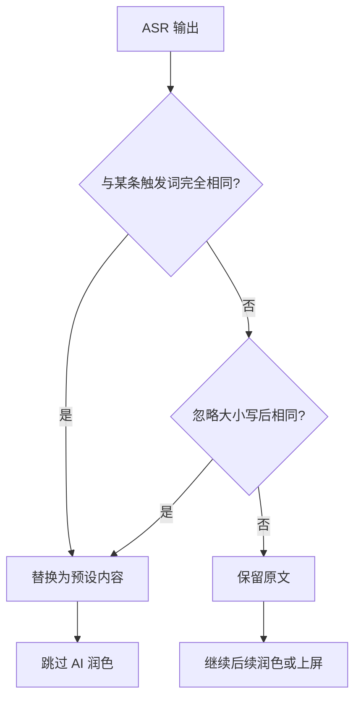

# 语音预设

语音预设功能允许您为常用短语或长句创建快捷替换规则，通过语音说出触发短语，自动替换为预设的完整内容，大幅提升重复输入效率。

::: info 名称说明
该功能在界面中叫「语音预置信息」，位于 `设置 → 系统 → 其他设置 → 语音预置信息`。本页统一使用「语音预设」指代该功能。
:::

## 功能介绍

### 工作原理



**核心逻辑**：

1. 正常进行语音识别
2. 识别结果与预设列表逐一匹配
3. 如果匹配成功（精确或忽略大小写），替换为预设内容
4. 否则保持原始识别结果

### 适用场景

::: tip 推荐使用

- ✅ **常用短语**：如邮箱地址、手机号、地址
- ✅ **固定回复**：如"收到"、"好的，马上处理"
- ✅ **专业术语**：如"ASR"→"Automatic Speech Recognition"
- ✅ **长文本模板**：如签名、免责声明
- ✅ **emoji 组合**：如"哈哈"→"哈哈哈 😄"
  :::

## 数据存储

预置列表保存在设备本地。每条预置 = 名称（触发词）+ 内容（替换文本）。

| 项目           | 说明                                       |
| -------------- | ------------------------------------------ |
| 预置信息列表   | 全部预置数据，导入导出跟随配置备份         |
| 当前预置信息   | 记录设置页当前选中的预置，不参与匹配       |

## 使用方法

### 创建预置

1. 进入 `设置 → 系统 → 其他设置 → 语音预置信息`
2. 点击「新增」按钮，会新建一条预置并自动选中
3. 在「预置信息名称」输入触发词（如"我的邮箱"）
4. 在「预置信息内容」输入完整内容（如"example@domain.com"）
5. 修改会自动保存

::: tip 命名建议

- 触发短语要**简短易说**，避免复杂句式
- 触发短语要**唯一明确**，避免与日常用语冲突
- 建议使用"我的 XXX"、"XXX 地址"等固定格式
  :::

### 使用预置

1. 正常进行语音输入
2. 说出的内容与某条预置的「名称」一致（如"我的邮箱"）
3. 识别结果自动替换为该预置的「内容」
4. 完整内容提交到编辑器

**完整流程示例**：

```
用户说："我的邮箱"
  ↓ [ASR 识别]
识别结果："我的邮箱"
  ↓ [匹配预置]
命中预置：名称"我的邮箱" → 内容"example@domain.com"
  ↓ [替换]
最终输出："example@domain.com"
```

### 编辑预置

1. 进入 `设置 → 系统 → 其他设置 → 语音预置信息`
2. 在「当前预置信息」下拉列表中选择要编辑的预置
3. 修改「预置信息名称」或「预置信息内容」，修改后自动保存

### 删除预置

1. 进入 `设置 → 系统 → 其他设置 → 语音预置信息`
2. 在「当前预置信息」下拉列表中选择要删除的预置
3. 点击「删除」按钮并确认

## 匹配规则

### 精确匹配优先

匹配流程：

1. **精确匹配**（Exact Match）：

   - 识别结果与预置名称**完全相同**（包括大小写、空格）
   - 优先级最高

2. **忽略大小写匹配**（Case-Insensitive Match）：
   - 识别结果与预置名称**内容相同**，但大小写不同
   - 作为备用匹配方案

### 匹配示例

| 预置名称   | 识别结果    | 是否匹配 | 匹配类型       |
| ---------- | ----------- | -------- | -------------- |
| "我的邮箱" | "我的邮箱"  | ✅       | 精确匹配       |
| "我的邮箱" | "我的邮 箱" | ❌       | 空格不匹配     |
| "ASR"      | "asr"       | ✅       | 忽略大小写     |
| "收到"     | "收到了"    | ❌       | 内容不完全一致 |
| "好的"     | " 好的 "    | ✅       | 自动 trim 空格 |

## 实用预设示例

### 个人信息类

#### 联系方式

```json
[
  {
    "name": "我的邮箱",
    "content": "your.email@example.com"
  },
  {
    "name": "我的手机",
    "content": "13800138000"
  },
  {
    "name": "我的地址",
    "content": "北京市朝阳区XX路XX号XX室"
  }
]
```

#### 社交账号

```json
[
  {
    "name": "我的微信",
    "content": "wxid_1234567890"
  },
  {
    "name": "我的推特",
    "content": "@YourTwitterHandle"
  },
  {
    "name": "我的GitHub",
    "content": "https://github.com/yourusername"
  }
]
```

### 模板文本类

#### 邮件签名

```json
[
  {
    "name": "邮件签名",
    "content": "此致\n敬礼！\n\n张三\n高级工程师\nXX科技有限公司\n手机：138xxxx8888\n邮箱：zhangsan@company.com"
  }
]
```

#### 免责声明

```json
[
  {
    "name": "免责声明",
    "content": "本信息仅供参考，不构成任何投资建议。投资有风险，入市需谨慎。"
  }
]
```

## 与其他功能协同

### 与 AI 后处理

语音预设在 AI 后处理**之前**执行：

```
语音识别 → [语音预设替换] → [AI 后处理] → 提交
```

### 与语音识别供应商

语音预设**不依赖**特定 ASR 供应商：

- ✅ 所有供应商的识别结果都会匹配预设
- ✅ 云端、本地识别均支持
- ✅ 流式、非流式模式均支持

**最佳实践**：
选择识别准确率高的供应商，确保触发短语识别正确。

### 与悬浮球

悬浮球语音输入**完全支持**语音预设：

```
悬浮球录音 → ASR 识别 → 预设匹配 → 输入到活动编辑器
```

适合在其他应用中快速输入预设内容。

## 注意事项

### 触发短语设计原则

::: warning 避免冲突

- ❌ 避免使用日常高频词（如"好的"、"知道了"）
- ❌ 避免过短的触发词（如单个字"哦"）
- ❌ 避免与常见表达冲突（如"谢谢"→ 长文本）
  :::

::: tip 推荐设计

- ✅ 使用固定格式（如"我的 XXX"、"XXX 地址"）
- ✅ 使用专有名词（如"公司邮箱"、"家庭住址"）
- ✅ 使用缩写（如"ASR"、"LLM"）
- ✅ 使用独特短语（如"插入签名"、"附加免责声明"）
  :::

### 性能考虑

- **预置数量**：预置数量很大时匹配按顺序逐条进行，量过大可能轻微影响性能
- **内容长度**：替换内容无限制，但过长可能影响输入体验

### 数据安全

- **本地存储**：所有预设存储在设备本地 SharedPreferences
- **备份建议**：使用应用内备份功能定期备份预设
- **隐私保护**：敏感信息（如密码）不建议存储在预设中

## 常见问题

### 预设不生效

**排查清单**：

1. ✅ 确认预设已添加成功（在列表中可见）
2. ✅ 确认触发短语拼写正确
3. ✅ 确认识别结果与触发短语一致（检查空格、标点）
4. ✅ 确认识别结果已 trim（去除首尾空格）

**常见原因**：

- 识别结果包含标点："我的邮箱。"与"我的邮箱"不匹配
- 识别结果有空格："我 的 邮 箱"与"我的邮箱"不匹配
- 大小写不一致：应自动兼容，如不生效请报告 Bug

## 相关功能

- [语音输入基础](./voice-input.md) - 了解识别流程
- [AI 后处理](./ai-postprocess.md) - 预设内容的后续处理
