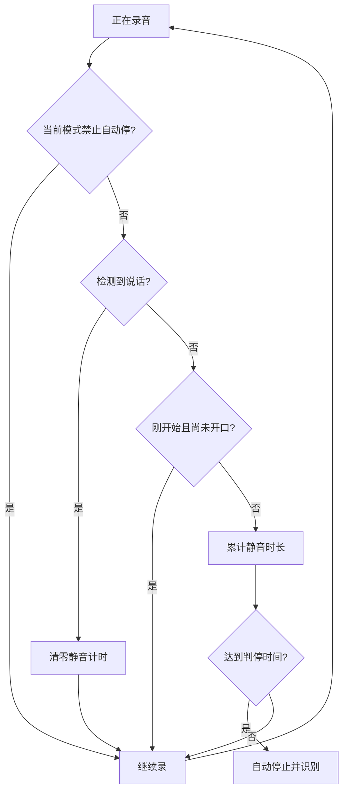

# 录音判停

录音判停能够在您停止说话后自动停止录音，无需手动操作。检测完全在本地离线完成（基于 Ten VAD 模型），不会因此上传任何音频。

## 概述

录音判停逐帧实时分析录音音频，判断是否有人说话，工作流程如下：

核心逻辑：

1. 逐帧实时分析录音音频，判断是否有人说话
2. 检测到静音后开始计时
3. 静音持续时间超过「判停时间阈值」（默认 1.2 秒）后，自动停止录音并提交识别

以下场景不会启用录音判停，避免还没松手就被判停：

- **长按说话**：松手才会停止录音
- **外部输入法通过 AIDL 控制的会话**：开始/停止由对方控制

录音判停对所有识别模式生效：判停后流式识别停止上传音频流，非流式识别与本地识别提交完整音频。

## 录音自动停止方式

录音何时自动结束由「录音自动停止方式」控制，路径：`设置 → 智能 → 语音识别设置 → 录音判停设置 → 录音自动停止方式`，三选一：

- **手动控制**（默认）：完全由松手或再次点击麦克风控制，不自动停止。
- **停说自动停止**：停止说话一段时间后自动结束录音，适合日常输入、短句、聊天。
- **超时停止**：到达「最长录音时长」后自动结束。它不判断是否有人说话，适合防止点按模式下忘记停止。

## 判停参数

以下两个参数仅在「录音自动停止方式」为「停说自动停止」时显示：

| 配置项 | 说明 | 默认值 |
| ------ | ---- | ------ |
| 判停时间阈值（毫秒） | 检测到静音后等待多久自动停止录音，可设 300–5000 毫秒 | 1200 |
| 判停灵敏度 | 数值 1–10，越高越容易停录 | 4 |

灵敏度参考：

| 档位 | 说明 | 适用场景 |
| ---- | ---- | -------- |
| 1–3 保守 | 只在非常确定静音时停止 | 嘈杂环境、说话声音小、经常停顿思考 |
| 4–6 平衡 | 正常判定，平衡准确性与响应速度 | 日常使用，办公室、家庭环境 |
| 7–10 敏感 | 快速响应，轻微停顿即触发 | 安静环境、连续说话、追求快速输入 |

### 推荐配置

- **日常聊天**：判停时间阈值 1000 毫秒、判停灵敏度 5——停顿约 1 秒自动停止，响应快。
- **文档口述**：判停时间阈值 1500 毫秒、判停灵敏度 4——允许短暂停顿思考，避免频繁误停。
- **会议记录**：判停时间阈值 2000 毫秒、判停灵敏度 3——避免发言人停顿时误停，适合多人对话。

## 最长录音时长

路径：`设置 → 智能 → 语音识别设置 → 录音判停设置 → 最长录音时长`。仅在「录音自动停止方式」为「超时停止」时显示，默认 120 秒，可设 30–600 秒。到达该时长后录音自动结束并识别，不依赖判停检测。

## 配套识别前处理

以下两项位于 `设置 → 输入 → 输入设置 → 音频与联动`，只影响非流式识别（文件上传或本地整段识别），不改变流式识别的实时上传：

- **自动撤销无效输入**：录音结束后先在本机检查其中是否有人声；若没有检测到人声，本次录音直接丢弃，不会发送给识别服务商，避免产生无意义请求。
- **自动过滤静音部分**：识别前在本机删除录音中的静音片段，缩短音频长度，可能减少上传时间，适合有明显停顿的长录音。

::: warning 注意
这两项默认关闭。嘈杂环境、说话声音很小或经常长时间停顿时，建议谨慎开启，避免有效语音被误判或被裁掉。
:::

## 常见问题

### 判停不生效（一直不停）

- 确认「录音自动停止方式」已选择「停说自动停止」，其他模式不会自动判停。
- 环境噪音（风扇、空调、键盘声）可能被误判为说话，可把「判停灵敏度」调低一些。
- 停顿时间需超过「判停时间阈值」，可适当调小该值。

### 说话中被误停

- 说话停顿时间过长、声音过小或离麦克风太远都可能触发误停。
- 把「判停灵敏度」调低（如 3），或把「判停时间阈值」调大（如 2000 毫秒）。

### 环境噪音导致停不下来

- 更换安静环境，或使用定向麦克风、降噪耳机。
- 把「判停灵敏度」调低（如 2），或暂时改用「手动控制」。

### 停止说话后延迟感明显

- 通常是「判停时间阈值」偏长，快速输入可降到 1000 毫秒左右（可能更容易误停）。
- 可参考上文「推荐配置」按场景取平衡。

## 相关功能

- [录音模式](./recording-modes.md) - 与判停搭配的录音触发方式
- [语音输入基础](./voice-input.md) - 了解识别流程
- [悬浮球功能](./floating-ball.md) - 在悬浮球中使用判停
