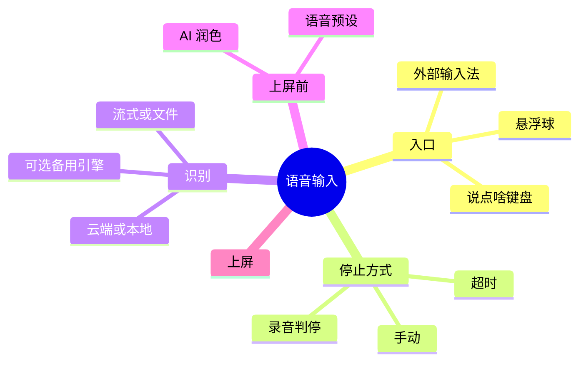
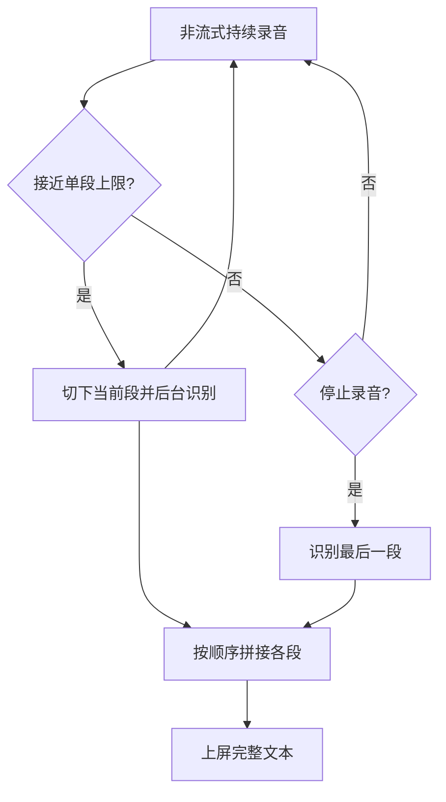
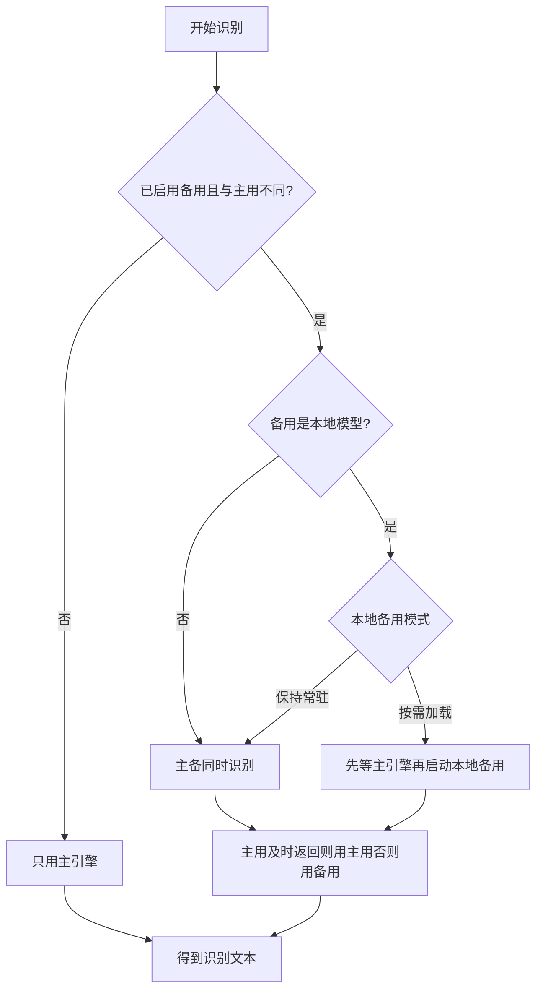

# 语音输入基础

说点啥的核心功能是高质量语音识别，支持多种 ASR 引擎和识别模式，让您在任何应用中都能轻松使用语音输入。

## 工作原理

语音输入流程分为三个阶段：

1. **录音阶段**：应用录制您的语音，并根据设置自动检测静音或手动停止
2. **识别阶段**：语音数据发送给 ASR 引擎（云端或本地），转换为文字
3. **输出阶段**：识别结果经过可选的 AI 后处理后，提交到当前编辑器

## 支持的 ASR 供应商

说点啥支持 **18 个** ASR 供应商，分为云端和本地两大类：

### 云端识别引擎

| 供应商                      | 流式模式 | 时长限制（非流式） | 特点                                                                                           |
| --------------------------- | -------- | ------------------ | ---------------------------------------------------------------------------------------------- |
| **Volcengine** 火山引擎  | ✅       | 1 小时             | 新用户通常赠送 20 小时免费额度，支持双向流式                                                   |
| **SiliconFlow** 硅基流动 | ❌       | 20 分钟            | 内置免费 ASR 服务（SenseVoiceSmall / TeleSpeechASR），支持 Qwen3-Omni 多模态转写（需自有 Key） |
| **ElevenLabs**              | ✅       | 20 分钟            | 高精度英文识别，支持文件与流式                                                                 |
| **OpenAI**                  | ✅       | 20 分钟            | 默认 `gpt-4o-mini-transcribe`，支持多渠道配置与 Realtime 流式识别                              |
| **DashScope** 阿里云百炼 | ✅       | 5 分钟             | Qwen-Audio-3.0 / Fun-ASR / Qwen3-ASR / Qwen3.5-Omni，支持流式与非流式                          |
| **Gemini** Google        | ❌       | 4 小时             | 基于文件的多模态语音理解                                                                       |
| **Soniox**                  | ✅       | 1 小时             | 支持多语言提示，流式与文件双模式                                                               |
| **StepAudio**               | ❌       | 20 分钟            | StepAudio 2.5 在线 ASR，支持中文、英文与 ITN                                                    |
| **Zhipu** 智谱           | ❌       | 20 分钟            | GLM-ASR，支持上下文提示参数                                                                    |
| **OpenRouter**              | ❌       | 20 分钟            | 通过 OpenRouter 调用兼容的 ASR / 多模态转写模型                                                |
| **MiMo** 小米            | ❌       | 20 分钟            | MiMo v2.5 ASR / 音频理解模型，支持语言选择与 System Prompt                                     |
| **Cohere**                   | ❌       | 12 分钟            | Cohere Transcribe 多语言文件识别，含通用与阿拉伯语模型                                         |

### 本地识别引擎（离线）

| 供应商         | 流式模式 | 时长限制（非流式） | 特点                                 |
| -------------- | -------- | ------------------ | ------------------------------------ |
| **SenseVoice** | 伪流式 ¹ | 5 分钟             | 基于 sherpa-onnx，支持多语言离线识别 |
| **FunASR Nano** | ❌      | 5 分钟             | 离线整段识别，支持语言选择、原生 ITN 与 MLT Nano 多语言变体 |
| **Qwen3-ASR** | ❌       | 5 分钟             | 本地 0.6B / 1.7B 模型，中文识别与数字格式化表现较好 |
| **Parakeet** | ❌       | 5 分钟             | 本地英语 / 欧洲语言识别模型 |
| **FireRedASR V2** | 伪流式 ¹ | 5 分钟             | 替代 TeleSpeech 的中英本地识别引擎 |
| **X-ASR** | ✅       | 无限制 ²           | 本地流式识别，支持中英 480ms 模型与可选 ITN |

::: info 注释说明
¹ **伪流式**：基于 VAD 分句提供部分结果预览，但非真正的实时流式识别

² 流式模式下无时长限制，可持续录音识别
:::

表格中的“时长限制（非流式）”指的是**应用内单段录音的上限**，用于控制分段录音行为，并不代表各家收费套餐或免费额度的上限。目前火山引擎通常会为新用户赠送约 20 小时的免费识别时长；硅基流动提供内置免费 ASR 服务且没有总时长额度限制，其他供应商的配额/计费请以各自控制台为准。

更多关于各供应商支持的模型、推荐配置，可参考整理的 [提供商与模型指南](https://brycewg.notion.site/bibi-keyboard-providers-guide)。各供应商的注册、配置与本地模型下载步骤，参见[首次设置](/getting-started/first-setup)与[供应商配置](/getting-started/asr-providers)。

## 云端 vs 本地识别

### 云端识别优势

- **高精度**：使用大型云端模型，识别准确率更高
- **多语言支持**：支持中英混合、方言、多国语言识别
- **免维护**：无需下载模型，自动获取最新模型更新

### 本地识别优势

- **完全离线**：无需网络连接，保护隐私
- **低延迟**：本地处理，无网络传输延迟
- **无流量消耗**：适合流量受限环境
- **无额度限制**：无需担心 API 配额和费用

## 流式 vs 非流式模式

### 流式识别

**工作原理**：边录音边上传，实时返回识别结果

**优势**：

- ✅ 实时反馈，可见即时识别结果
- ✅ 无时长限制，支持长时间录音
- ✅ 延迟更低，说话即转文字

**支持的引擎**：

- 云端：Volcengine、Soniox、DashScope、ElevenLabs、OpenAI Realtime
- 本地：X-ASR

### 非流式识别（文件上传）

**工作原理**：录音结束后上传完整音频文件进行识别

**优势**：

- ✅ 处理精度更高（引擎可全局分析音频）
- ✅ 实现简单，稳定性好
- ✅ 支持更多供应商

**限制**：

- ⚠️ 有时长限制（见上表）
- ⚠️ 需等待录音结束才开始识别

本地非流式模型会在录音结束后分块识别长音频，以降低单次推理压力并更快产出完整结果；无需额外设置。

::: tip 配置建议

- 支持双模式的供应商可在 `设置 → 智能 → 语音识别设置 → 语音识别服务商 → [供应商名]` 中切换模式
- 流式模式适合长时间录音和实时反馈需求
- 文件模式适合追求高精度的短语音识别
  :::

## 分段录音功能

对于非流式引擎，当录音超过应用内为该供应商设置的单段时长上限时，说点啥会自动进行**分段录音**：

### 工作机制

1. **自动分割**：接近时长限制时，自动切分当前段并开始下一段录音
2. **后台上传**：切分的音频段在后台上传识别，不影响继续录音
3. **无缝体验**：界面保持录音状态，用户无感知中断
4. **结果合并**：所有段的识别结果自动拼接为完整文本

## 备用 ASR 引擎（并行主备）

当主用 ASR 偶发超时或失败时，可以启用「备用语音识别引擎」：录音只采集一次，由系统根据主用/备用的引擎能力和当前配置决定并行或本地懒加载兜底；主用在合理时间内给出可用结果则采用主用，否则自动采用备用结果。

### 开启方法

1. 打开 `设置 → 智能 → 语音识别设置`
2. 找到「备用语音识别引擎」，开启「启用备用引擎」
3. 点击「备用服务商」，选择一个与主用不同的供应商
4. 确保备用供应商也已完成配置（API Key / 模型文件等）
5. 如果主用是本地模型或响应较慢的模型，可调整「备用引擎超时阈值敏感度」，让系统更早或更晚切到备用结果
6. 如果备用服务商是本地模型，可在「本地备用模式」中选择「按需加载」或「保持常驻」

### 本地备用模式

| 模式 | 说明 | 适用场景 |
| ---- | ---- | -------- |
| **按需加载** | 默认模式。需要兜底时再启动本地备用模型，空闲后释放，节省内存 | 偶尔需要备用、本地模型较大、希望降低常驻资源占用 |
| **保持常驻** | 提前保持本地备用模型可用，以换取更快的兜底响应 | 经常依赖本地备用、设备内存充足、希望减少第一次备用等待 |

::: warning 注意
启用备用后，在线备用可能产生额外请求/费用；本地备用则可能占用更多内存。选择本地「保持常驻」前，建议确认设备内存余量。
:::

## 输入完成后的输入法切换

语音输入常用在聊天等场景，说完后往往希望立刻切回常用键盘做二次编辑。相关开关位于 `设置 → 输入 → 输入设置 → 输入行为`：

- **输入完成后切换到指定输入法**：识别（及可选 AI 后处理）完成、预览文本固化后，自动切换到 `指定输入法` 中选定的输入法；未指定时切换到上一个输入法。识别结果为空时不会切换。
- **键盘收起后切换到指定输入法**：收起说点啥键盘时自动切换到指定输入法（未指定则返回上一个输入法），方便临时语音输入。

## 本地模型标点（可选）

FireRedASR V2 支持使用额外的「通用标点模型」为离线识别结果自动补全标点（模型缺失时不影响识别，只是结果可能更“口语化”）。

1. 打开 `设置 → 智能 → 语音识别设置`
2. 进入 `FireRedASR V2` 的设置区域
3. 在「通用标点模型」中点击「下载模型」（或导入 ZIP）

::: tip 下载源选择
下载本地模型时会弹出“下载源选择”，并显示延迟测速结果；优先选延迟更低的源通常更稳定。
:::

## 识别增强（可选）

- **可见时持续录音**：`设置 → 输入设置 → 可见时持续录音`。键盘或悬浮球可见期间在本机持续录音，点击麦克风后可以更快开始识别，减少录音延迟；触发识别前的音频不会上传。
- **非流式识别降噪**：`设置 → 输入设置 → 非流式识别降噪`（对文件识别与本地离线识别生效）
- **上传音频前压缩**：`设置 → 输入 → 输入设置 → 音频与联动 → 上传音频前压缩`。在线非流式识别在供应商支持时会先压缩为 M4A/AAC、OGG Opus 或 WAV，减少上传体积和等待时间；OpenAI 自定义兼容转写端点会使用 WAV 上传以提高兼容性。
- **去除句末标点与 emoji**：`设置 → 输入设置 → 去除句末标点与 emoji`。可设置字数阈值，短句自动去掉末尾标点和 emoji，长文本保留完整结尾。

## 识别历史与统计项

可在 `设置 → 智能 → 识别历史` 查看历史记录。历史来源包含：

- **键盘输入**
- **悬浮球输入**
- **外部输入**（如通过外部 AIDL 接入）

每条记录会展示基础信息（供应商、来源、AI 处理状态、字数、音频时长），并在可统计时展示以下耗时项：

- **总耗时**：从开始录音到最终文本提交完成的端到端耗时。
- **识别耗时**：ASR 识别阶段耗时（供应商处理耗时）。
- **AI 后处理耗时**：启用并尝试 AI 后处理时显示，对应后处理阶段耗时。

新版记录的历史详情还提供耗时时间轴，按录音 / 音频输入、语音识别、后处理、AI 润色、文字写入等阶段展示各步耗时。

### 失败记录与重试

识别失败、超时或取消的记录也会被保留在历史中，并显示失败原因（如鉴权失败、麦克风被占用、网络不可用、识别超时等）。保留录音的记录可以重新识别或重新润色。

### 键盘内的识别历史

在自定义键盘布局的扩展按键中配置「识别历史」后，可以在键盘内直接打开历史面板：

- 点击条目即可将该条文本插入当前输入框
- **右滑**条目：重新润色（需已配置 LLM 且有可用文本）
- **左滑**条目：重新识别（需该条保留有录音音频）

识别历史页还提供 [API Log 与录音测试](/advanced/diagnostics) 入口，用于查看 ASR / LLM 调用摘要、本地模型加载记录以及当前配置的录音测试结果。

## 相关功能

- [悬浮球功能](./floating-ball.md) - 在任意应用使用语音输入
- [AI 后处理](./ai-postprocess.md) - 使用 LLM 优化识别结果
- [录音模式](./recording-modes.md) - 长按、点按、连续对话模式
- [录音判停](./vad.md) - 自动检测静音停止录音
