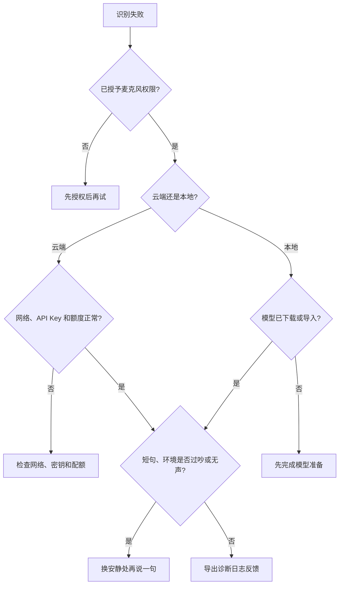

# 常见问题

本页整理说点啥使用过程中的常见问题与排查方向。

## 语音识别失败怎么办？

1. 检查麦克风权限是否已授予。
2. 如果使用云端 ASR，确认网络可用、API Key 正确且账户仍有额度。
3. 如果使用本地模型，确认模型已下载或导入完成。
4. 换一个短句测试，排除录音太短、环境太嘈杂或没有声音输入的情况。

## 如何导出诊断日志？

说点啥会记录必要的运行诊断信息，便于排查崩溃、录音失败、模型加载失败等问题。

1. 打开 `设置 → 关于`
2. 找到诊断日志相关入口
3. 导出日志后，在反馈问题时一并提供

## 本地模型第一次识别很慢？

本地模型首次加载需要把模型文件读入内存，耗时取决于设备性能和模型大小。可以在对应本地模型设置中开启「积极加载模型」，让键盘或悬浮球出现时提前准备模型；并通过「模型卸载策略」控制识别结束后模型在内存中的保留时间（可选：不保留、5/15/30 分钟、始终保持），避免反复加载。

## OpenAI Realtime 没有流式结果？

OpenAI 供应商需要在对应渠道中开启「流式识别」（Realtime），并且端点必须支持 Realtime API。如果使用第三方兼容接口，请确认该服务不是只兼容 `/v1/audio/transcriptions` 文件转写。

## 修改版输入法 / IME Bridge 不工作怎么办？

1. 在 `设置 → 输入 → 更多输入方式 → 高级功能` 中查看「输入法 Hook 模块状态」，点击状态即可刷新
2. 确认 LSPosed 作用域只勾选了目标输入法，然后强制停止并重新打开该输入法（必要时重启设备）；使用 LSPatch 时，输入法更新后需要重新修补

详见 [IME Bridge 模块](/advanced/ime-bridge)。

## AIDL 联动提示未授权（403）？

外部输入法调用说点啥识别时返回 403，通常是说点啥侧的联动开关未打开：进入 `设置 → 输入 → 输入设置 → 音频与联动`，开启「允许外部输入法联动（AIDL）」后重试。详见 [外部输入法联动（AIDL）](/advanced/aidl-integration)。

## 悬浮球经常消失？

部分系统会回收后台服务或无障碍服务。可以先在 `设置 → 其他设置` 中开启前台服务保活，并申请电池优化白名单；如果设备管控仍然很严格，再考虑 Shizuku / Root 增强保活。
